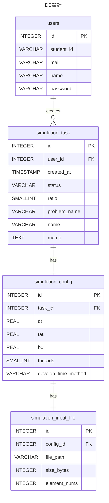
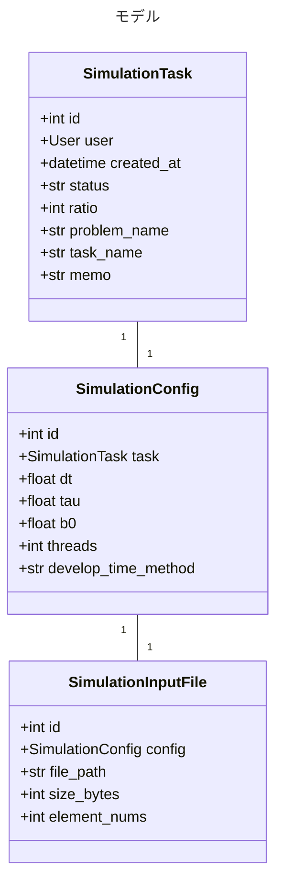
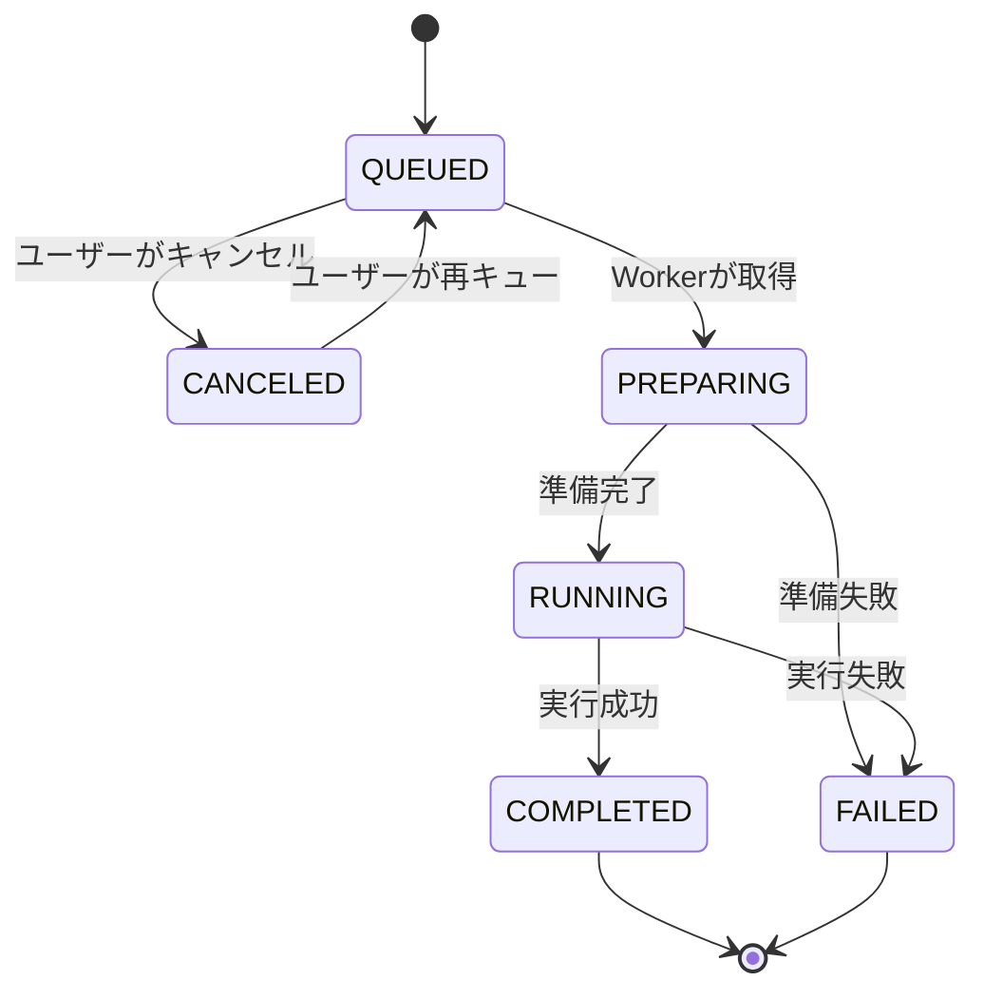

# 概要
シミュレーションタスクの作成・確認・編集・削除を行うアプリケーション。  
シミュレーションタスクは、量子アニーリングシミュレーションを実行するために必要な設定値と入力データを保持するオブジェクトである。Worker はデータベース上のシミュレーションタスクを参照し、実行可能なタスクを順次取得してシミュレーションを実行する。

シミュレーションタスクは、主に以下の情報を保持する。

- タスクの固有ID
- タスクを作成したユーザー
- タスクの作成日時
- タスクの実行状況
- シミュレーション進行割合
- 解決対象の最適化問題名
- ユーザーが識別するためのタスク名（任意）
- メモ（任意）
- シミュレーションで用いるハイパーパラメータ
- 対角項データの入力ファイル情報
- シミュレータの実行設定

本アプリケーションは、主にシミュレーションタスクの生成・確認・編集・削除を担当する。実際のシミュレーション実行処理は Worker が担当し、本アプリケーションは Worker を直接呼び出さない。Worker との連携はデータベースを介して行う。

# 本アプリケーションが持つ機能
## タスク作成機能
フロントにてユーザーが入力した値を用いて、シミュレーションタスクを作成する。フロントから受け取るデータは以下の通り。

- 最適化問題名
- タスク名（任意）
- ハイパーパラメータ
  - 単位時間変化量（dt）
  - 終端時間（tau）
  - 初期磁場（b0）
- 対角項データ
- シミュレーション設定
  - スレッド数
  - 時間発展メソッド
- メモ（任意）

上記以外のデータについては、バックエンド側で自動的に挿入する。

| 項目 | 値 |
| --- | --- |
| 作成ユーザー | ログイン中のユーザー |
| 作成日時 | タスク作成時点の日時 |
| 実行状況 | `QUEUED` |
| 進行割合 | `0` |

対角項データとして受け取れるファイル形式は以下の通りとする。

- `.csv`
- `.bin`

対角項データの各値は `f64` として扱う。  
フロントは、対角項データについて以下の軽いチェックを行った後、そのままバックエンドに送信する。

- ファイル形式が `.csv` または `.bin` であること
- ファイルサイズが 0 byte でないこと

実際の内容検証、`.csv` から `.bin` への変換、保存先の決定、メタデータの保存はバックエンド側で行う。

## タスク確認機能
ユーザーは、全ユーザーの過去を含むタスク一覧を閲覧できる。  
研究室内で知見を共有する目的があるため、自分以外のユーザーが作成したタスクも閲覧可能とする。

タスク一覧では、最初にジョブ管理に関わる項目のみを表示する。

- タスク名
- 作成ユーザー
- 作成日時
- 実行状況
- 進行割合
- 最適化問題名

ユーザーが一覧上のタスクを選択することで、シミュレーション設定を含む詳細情報を確認できる。

フロントでは、過去のタスクを活用しやすくするために、検索・フィルター・並び替え機能を実装する。

## 最適化問題名の扱い
シミュレーションタスクには、解決対象の最適化問題名として `problem_name` を必須で登録する。

`problem_name` は、研究室内で過去タスクを知識資源として再利用しやすくするための分類・検索用項目である。タスク名とは役割が異なるため、タスク名とは別項目として管理する。

| 項目 | 役割 | 入力必須 | 例 |
| --- | --- | --- | --- |
| `problem_name` | 解決対象の最適化問題を表す分類名 | 必須 | `整数分割問題`、`巡回セールスマン問題`、`3人囚人のジレンマ` |
| `name` | 個別の実行タスクを識別するための任意名 | 任意 | `tau=20 dt=0.001`、`WARP版比較用` |
| `memo` | 実験意図・補足・考察などの自由記述 | 任意 | `先行実験と同一条件で再実行` |

`problem_name` は自由記述とする。MVPでは最適化問題を独立したマスタとして管理しない。
ただし、検索・フィルター対象として利用するため、空文字列は許可しない。

表記ゆれを完全に防ぐことはMVPでは対象外とする。将来的に表記ゆれや分類管理が問題になった場合は、`Problem` モデルを独立させ、`SimulationTask` から外部キーで参照する設計を検討する。

## 対角項確認機能
対角項データはデータ量が大きく、生データのままでは確認しづらいため、専用の表示画面で確認する。  
対角項データ取得APIではバイナリデータを返却し、フロント側で必要に応じて表示用に整形する。

表示画面では、少なくとも以下の情報を表示する。

- ファイルサイズ
- 要素数
- 先頭の一部データ
- 必要に応じたページングまたは範囲指定表示

## タスク編集機能
ユーザーがタスク情報を変更するための機能。  
ユーザーは、自身が作成したタスクに限り、以下の情報を変更できる。

- 最適化問題名
- タスク名
- ハイパーパラメータ
- 対角項データ
- シミュレーション設定
- メモ
- 実行状況（`QUEUED` と `CANCELED` の切り替えのみ）

編集可能条件は以下の通りとする。

| 更新対象 | 更新可能条件 |
| --- | --- |
| 最適化問題名 | 自身が作成したタスクであれば、原則いつでも更新可能。ただし空文字列は不可 |
| タスク名 | 自身が作成したタスクであれば、原則いつでも更新可能 |
| メモ | 自身が作成したタスクであれば、原則いつでも更新可能 |
| ハイパーパラメータ | 自身が作成したタスク、かつ実行状況が `QUEUED` または `CANCELED` |
| シミュレーション設定 | 自身が作成したタスク、かつ実行状況が `QUEUED` または `CANCELED` |
| 対角項データ | 自身が作成したタスク、かつ実行状況が `QUEUED` または `CANCELED` |
| 実行状況 | `QUEUED` から `CANCELED`、または `CANCELED` から `QUEUED` のみ |

対角項データはファイルの検証処理を伴うため、通常のタスク更新APIとは切り離し、専用APIで置き換える。  
タスク編集を行っても、タスク作成日時は変更しない。

## タスク削除機能
ユーザーは、自身が作成したタスクを削除できる。  
ただし、Worker が処理中のタスクを削除すると整合性が崩れるため、削除可能なタスクは以下の状態に限定する。

- `QUEUED`
- `CANCELED`
- `FAILED`

`PREPARING`、`RUNNING`、`COMPLETED` のタスクは削除できないものとする。  
実行済みタスクは研究室内の知見として残す価値があるため、原則として削除不可とする。

タスクを削除すると、以下の処理を行う。

- データベースから該当する `SimulationTask` を削除する
- 紐付く `SimulationConfig` を削除する
- 紐付く `SimulationInputFile` を削除する
- サーバー上の関連ファイルを削除する

ファイル削除に失敗した場合は、データベースとの不整合を避けるため、原則としてトランザクションをロールバックする。ただし、実装上ファイルシステム操作はDBトランザクションに完全には含められないため、削除失敗時のログ記録と再実行可能な設計を行う。

## タスクキャンセル機能
ユーザーは、自身が作成した `QUEUED` 状態のタスクを `CANCELED` に変更できる。  
これは、キューに入れたタスクの設定ミスに気づいた際に、一時的に実行対象から外し、落ち着いて設定変更できるようにするための機能である。

また、`CANCELED` 状態のタスクは、いつでも `QUEUED` に戻すことができる。  
`PREPARING` または `RUNNING` 状態のタスクは、Worker 側の中断制御が必要になるため、本アプリケーションではキャンセル対象外とする。

# モデル
以下に、各種モデルの定義について記述する。  
本アプリケーションでは、基本的に Django のモデル機構を利用してモデルを作成する。したがって、以下のモデルは概念モデルであり、実際のDjangoモデルとは一部異なる可能性がある。

タスクは、タスクのジョブ管理を行うためのメタデータと、シミュレーション設定の二つに大別できる。これらを二つのモデルとして分割し、1対1の関係とする。  
また、シミュレーションの入力ファイルのメタデータを保持するモデルを別途用意する。

- `SimulationTask` : タスクのジョブ管理
- `SimulationConfig` : シミュレーションの設定
- `SimulationInputFile` : シミュレーションに使用する対角項データのファイル情報

## 進行状況
タスクの進行状況は、必ず以下のいずれかを取るものとする。

| 進行状況 | 説明 |
| --- | --- |
| `QUEUED` | 実行待ち状態。タスク作成日時順に実行されるのを待っている状態 |
| `PREPARING` | 実行準備中。対角項データや設定を読み取り、GPU計算環境を作成している状態 |
| `RUNNING` | 実行中。実行準備が終了し、実際に時間発展を行っている状態 |
| `COMPLETED` | 実行完了。正常にシミュレーションが終了し、結果が保存されている状態 |
| `FAILED` | 実行失敗。何らかのエラーによってシミュレーションが失敗した状態 |
| `CANCELED` | 実行キャンセル。未実行だが、キューから外されている状態 |

## 時間発展メソッド
時間発展メソッドは、必ず以下のいずれかを取るものとする。

| メソッド名            | 説明                                                     |
| ---------------- | ------------------------------------------------------ |
| `NORMAL`         | 最もシンプルな時間発展メソッド。1スレッドが1行の計算を行う。スレッド数が小さい場合に有効          |
| `WARP`           | ワープ単位で1行の計算を行う。スレッド数が大きい場合に有効                          |
| `QUADRATIC_WARP` | 二次の項までの計算を含む時間発展関数を使用して計算を行う。精度が大きく向上するものの、使用メモリが増加する。 |
| `AUTO`           | スレッド数などの各種パラメータに応じて自動的にメソッドを決定する                       |

## DB設計


## SimulationTask
| 項目           | 型        | 制約                           | 説明                                                                            |
| ------------ | -------- | ---------------------------- | ----------------------------------------------------------------------------- |
| id           | int      | PK, Auto Increment           | シミュレーションタスクID                                                                 |
| user         | User     | FK, required                 | タスクを作成したユーザー                                                                  |
| created_at   | datetime | required                     | タスク作成日時                                                                       |
| status       | string   | required, choices            | タスクの進行状況。`QUEUED`、`PREPARING`、`RUNNING`、`COMPLETED`、`FAILED`、`CANCELED` のいずれか |
| ratio        | int      | required, 0以上100以下           | シミュレーション進行割合。0〜100の整数                                                         |
| problem_name | string   | required, max_length=128     | 解決対象の最適化問題名。検索・分類に利用する自由記述項目                                                  |
| task_name    | string   | max_length=64, blank allowed | ユーザーがタスクを識別するための任意名                                                           |
| memo         | text     | blank allowed                | ユーザーがタスクに残す任意メモ                                                               |

## SimulationConfig
| 項目 | 型 | 制約 | 説明 |
| --- | --- | --- | --- |
| id | int | PK, Auto Increment | シミュレーション設定ID |
| task | SimulationTask | OneToOne, required | 紐付くシミュレーションタスク |
| dt | float | required, 0より大きい | 単位時間変化量 |
| tau | float | required, 0より大きい | 終端時間 |
| b0 | float | required, 0以上 | 初期磁場 |
| threads | int | required, 2のべき乗 | GPU計算における1ブロックあたりのスレッド数 |
| develop_time_method | string | required, choices | 時間発展メソッド。`NORMAL`、`WARP`、`AUTO` のいずれか |

## SimulationInputFile
| 項目           | 型                | 制約                       | 説明                        |
| ------------ | ---------------- | ------------------------ | ------------------------- |
| id           | int              | PK, Auto Increment       | 入力ファイルID                  |
| config       | SimulationConfig | OneToOne, required       | 紐付くシミュレーション設定             |
| file_path    | string           | required, max_length=512 | サーバー上に保存された対角項バイナリファイルのパス |
| size_bytes   | int              | required, 0より大きい         | ファイルサイズ                   |
| element_nums | int              | required, 2のべき乗          | 対角項ベクトルの要素数               |

## クラス図


# 対角項データの扱い
対角項データは、サーバーに直接ファイルとして保存する。  
シミュレーションに関連するファイルは、共通仕様に従い `{root}/bin/{task_id}/` 配下に保存する。`{root}` は環境変数から読み取る。

本アプリケーションでは、対角項データを以下のパスに保存する。

```text
{root}/bin/{task_id}/input/diagonal_vector.bin
```

`.csv` ファイルを受け取った場合は、バックエンド側で `.bin` ファイルに変換する。  
変換後、元の `.csv` ファイルは保存せず削除する。  
`.bin` ファイルを受け取った場合は、内容検証後、上記パスに保存する。

## 対角項データの検証項目
バックエンドは、対角項データ保存時または更新時に以下を検証する。

| 項目         | 内容                              |
| ---------- | ------------------------------- |
| ファイル形式     | `.csv` または `.bin` であること         |
| ファイルサイズ    | 0 byte でないこと                    |
| 要素型        | 各値を `f64` として解釈できること            |
| 要素数        | 0ではなく、2のべき乗であること                |
| binファイルサイズ | `element_nums * 8` byte と一致すること |

検証後、以下のメタデータを `SimulationInputFile` に保存する。

- `file_path`
- `size_bytes`
- `element_nums`

# API
本アプリケーションが実装する全てのAPIは `api/task/` から始まる。  
失敗時のレスポンス形式は共通仕様に従い、同じステータスコードで複数種類のエラーを返す場合は以下の形式で返却する。

```json
{
    "code": "ERROR_CODE",
    "message": "エラー内容"
}
```

## タスク登録API
シミュレーションタスクの登録を行うためのAPI。  
タスク本体、シミュレーション設定、対角項入力ファイルをまとめて作成する。  
登録成功後、与えられた対角項のうち、値が小さい上位10件の値と状態番号を返却する。これにより、ユーザーは渡した対角項ファイルが正しいことを確認できる。  

- URL: `api/task`
- メソッド: `POST`
- 認証: 必須
- Content-Type: `multipart/form-data`

### リクエスト
| 項目                  | 型      | 必須  | 説明                                                     |
| ------------------- | ------ | --- | ------------------------------------------------------ |
| task_name           | string | 任意  | ユーザーがタスクを識別しやすくするためのタスク名                               |
| problem_name        | string | 必須  | 解決対象の最適化問題名                                            |
| dt                  | float  | 必須  | シミュレーション時にステップごとに進める時間の大きさ                             |
| tau                 | float  | 必須  | シミュレーションを終えるまでの時間                                      |
| b0                  | float  | 必須  | シミュレーション時の初期磁場の大きさ                                     |
| threads             | int    | 必須  | GPUが1ブロックに割り当てるスレッド数。2のべき乗である必要がある                     |
| develop_time_method | string | 必須  | 時間発展メソッド。`NORMAL`、`WARP`、`QUADRATIC_WARP`、`AUTO` のいずれか |
| memo                | string | 任意  | ユーザーがタスクに残すメモ                                          |
| input_file          | file   | 必須  | 対角項データを保持する `.csv` または `.bin` ファイル                     |

### 自動設定される値
| 項目     | 既定値        |
| ------ | ---------- |
| 作成ユーザー | ログイン中のユーザー |
| 作成日時   | タスク登録時点の日時 |
| 実行状況   | `QUEUED`   |
| 進行割合   | `0`        |

### 成功時
ステータスコード: 201 Created

```json
{
    "id": 1,
    min_values: [
	    {
		    state: 1,
		    value: 0
	    },
	    {
		    state: 6,
		    value: 0
	    },
	    {
		    state: 2,
		    value: 15
	    }
    ]
}
```

### 失敗時
| ステータス | コード | 発生要因 | 備考 |
| --- | --- | --- | --- |
| 400 Bad Request | `LACK_OF_VALUE` | 必須項目が不足している | どの項目が不足しているかは `message` に含める |
| 400 | `PROBLEM_NAME_REQUIRED` | 最適化問題名が指定されていない、または空文字列である |  |
| 400 | `INVALID_PROBLEM_NAME` | 最適化問題名が長すぎる | `max_length=128` を超える場合 |
| 400 | `INVALID_PARAMETER` | `dt`、`tau`、`b0` などの数値が不正 | 例: `dt <= 0`、`tau <= 0` |
| 400 | `INVALID_THREADS` | スレッド数が2のべき乗でない、または0以下 |  |
| 400 | `INVALID_FILE_FORMAT` | 対角項データファイルの形式が `.csv` または `.bin` でない |  |
| 400 | `INVALID_DEVELOP_TIME_METHOD` | 未定義の時間発展メソッドが指定された |  |
| 400 | `INVALID_ELEMENT_NUMS` | 対角項の要素数が0、または2のべき乗でない |  |
| 400 | `INVALID_FILE_CONTENT` | 対角項データを `i32` として解釈できない |  |
| 401 Unauthorized | `UNAUTHORIZED` | 未ログイン状態でアクセスされた |  |
| 500 Internal Server Error | `FILE_SAVE_FAILED` | ファイル保存に失敗した | ログを記録する |

## 上位タスク取得API
DBから指定条件に合うタスクを取得するAPI。  
「作成日時が新しい順に0番目から10番目まで」のように、並び順と取得範囲を指定する。  
対角項データそのものは返却しない。

`problem_name` が指定された場合は、最適化問題名に対して部分一致検索を行う。大文字・小文字の区別については、DBの照合順序または実装に依存するため、MVPでは厳密に規定しない。

- URL: `api/task/order`
- メソッド: `POST`
- 認証: 不要

### リクエスト
| 項目 | 型 | 必須 | 説明 |
| --- | --- | --- | --- |
| elem_start | int | 必須 | 取得開始位置。0始まり。自身を含む |
| elem_end | int | 必須 | 取得終了位置。自身を含まない |
| order | string | 任意 | `ASC` または `DESC`。未指定の場合は `DESC` |
| user | string/null | 任意 | ユーザーで絞り込む場合の学生証番号またはユーザー名。指定なしの場合は `null` |
| problem_name | string/null | 任意 | 最適化問題名で絞り込む場合に指定。指定なしの場合は `null` |
| date_start | string/null | 任意 | 作成日時の開始日。形式は `yyyy-MM-dd` または `yyyy-MM-ddTHH:mm:ss` |
| date_end | string/null | 任意 | 作成日時の終了日。形式は `yyyy-MM-dd` または `yyyy-MM-ddTHH:mm:ss` |
| status | string/null | 任意 | 進行状況で絞り込む場合に指定 |

```json
{
    "elem_start": 0,
    "elem_end": 10,
    "order": "DESC",
    "user": null,
    "problem_name": null,
    "date_start": null,
    "date_end": null,
    "status": null
}
```

### 成功時
ステータスコード: 200 OK

```json
{
	tasks: [
	    {
	        "id": 1,
	        "user": {
	            "student_id": "B1234567",
	            "name": "山田太郎"
	        },
	        "created_at": "2026-05-07T18:09:32",
	        "status": "QUEUED",
	        "ratio": 0,
	        "problem_name": "整数分割問題",
	        "name": "サンプルタスク",
	        "memo": "テスト実行",
	    }
	],
	total_tasks: 1000
}
```

### 失敗時
| ステータス | コード | 発生要因 | 備考 |
| --- | --- | --- | --- |
| 400 Bad Request | `INVALID_RANGE` | `elem_start` または `elem_end` が不正 | 例: `elem_start < 0`、`elem_end <= elem_start` |
| 400 | `INVALID_ORDER` | `ASC` または `DESC` 以外が指定された |  |
| 400 | `INVALID_DATE_FORMAT` | 日時文字列の形式が不正 |  |
| 400 | `INVALID_STATUS` | 未定義の進行状況が指定された |  |
| 400 | `INVALID_PROBLEM_NAME` | 最適化問題名の検索条件が長すぎる | `max_length=128` を超える場合 |

## タスク取得API
IDを用いてタスクデータを取得するためのAPI。  
対角項データそのものは返却しない。対角項データが必要な場合は、対角項データ取得APIを利用する。

- URL: `api/task/{id}`
- メソッド: `GET`
- 認証: 不要

### 成功時
ステータスコード: 200 OK

```json
{
    "id": 1,
    "user": {
        "student_id": "B1234567",
        "name": "山田太郎"
    },
    "created_at": "2026-05-07T18:09:32",
    "status": "QUEUED",
    "ratio": 0,
    "problem_name": "整数分割問題",
    "name": "サンプルタスク",
    "memo": "テスト実行",
    "config": {
        "id": 1,
        "dt": 0.001,
        "tau": 20.0,
        "b0": 10.0,
        "threads": 32,
        "develop_time_method": "AUTO",
        "input_file": {
            "id": 1,
            "size_bytes": 8388608,
            "element_nums": 2097152
        }
    }
}
```

### 失敗時
| ステータス           | コード               | 発生要因              | 備考  |
| --------------- | ----------------- | ----------------- | --- |
| 400 Bad Request | `INVALID_TASK_ID` | タスクIDが整数として解釈できない |     |
| 404 Not Found   | `TASK_NOT_FOUND`  | 指定されたIDのタスクが存在しない |     |

## タスク更新API
特定のタスクデータを更新するためのAPI。  
更新対象は `SimulationTask` で管理する値のみとし、`SimulationConfig` で管理する値はコンフィグ更新APIで扱う。  
タスクのキャンセル・再キューもこのAPIで行う。

- URL: `api/task`
- メソッド: `PATCH`
- 認証: 必須
- Content-Type: `application/json`

### リクエスト
更新が必要な値のみ渡してよい。

| 項目 | 型 | 必須 | 説明 |
| --- | --- | --- | --- |
| id | int | 必須 | 更新対象のタスクID |
| problem_name | string | 任意 | 解決対象の最適化問題名。空文字列は不可 |
| name | string | 任意 | タスク名 |
| memo | string | 任意 | メモ |
| status | string | 任意 | `QUEUED` または `CANCELED` への変更のみ許可 |

```json
{
    "id": 1,
    "problem_name": "整数分割問題",
    "name": "更新後のタスク名",
    "memo": "更新後のメモ"
}
```

キャンセルする場合:

```json
{
    "id": 1,
    "status": "CANCELED"
}
```

再度キューに戻す場合:

```json
{
    "id": 1,
    "status": "QUEUED"
}
```

### 成功時
ステータスコード: 204 No Content

### 失敗時
| ステータス | コード | 発生要因 | 備考 |
| --- | --- | --- | --- |
| 400 Bad Request | `LACK_OF_VALUE` | `id` が指定されていない |  |
| 400 | `PROBLEM_NAME_REQUIRED` | `problem_name` に空文字列を指定した |  |
| 400 | `INVALID_PROBLEM_NAME` | 最適化問題名が長すぎる | `max_length=128` を超える場合 |
| 400 | `INVALID_TASK_ID` | タスクIDが整数として解釈できない |  |
| 400 | `INVALID_STATUS` | 許可されていない進行状況が指定された |  |
| 400 | `INVALID_STATUS_TRANSITION` | 許可されていない状態遷移を行おうとした | 例: `RUNNING` から `CANCELED` |
| 401 Unauthorized | `UNAUTHORIZED` | 未ログイン状態でアクセスされた |  |
| 403 Forbidden | `FORBIDDEN` | 自分以外が作成したタスクを更新しようとした |  |
| 404 Not Found | `TASK_NOT_FOUND` | 指定されたIDのタスクが存在しない |  |

## タスク削除API
指定したタスクを削除するためのAPI。  
該当タスクに紐付く `SimulationConfig`、`SimulationInputFile`、関連ファイルも削除する。

- URL: `api/task/{id}`
- メソッド: `DELETE`
- 認証: 必須

### 成功時
ステータスコード: 204 No Content

### 失敗時
| ステータス | コード | 発生要因 | 備考 |
| --- | --- | --- | --- |
| 400 Bad Request | `INVALID_TASK_ID` | タスクIDが整数として解釈できない |  |
| 400 | `TASK_CANNOT_DELETE` | 削除できない状態のタスクを削除しようとした | `PREPARING`、`RUNNING`、`COMPLETED` は削除不可 |
| 401 Unauthorized | `UNAUTHORIZED` | 未ログイン状態でアクセスされた |  |
| 403 Forbidden | `FORBIDDEN` | 自分以外が作成したタスクを削除しようとした |  |
| 404 Not Found | `TASK_NOT_FOUND` | 指定されたIDのタスクが存在しない |  |
| 500 Internal Server Error | `FILE_DELETE_FAILED` | 関連ファイルの削除に失敗した | ログを記録する |

## コンフィグ取得API
指定したタスクに紐付く `SimulationConfig` データを取得するためのAPI。  
タスクIDを用いてコンフィグを検索する。  
対角項データそのものは返却しない。

- URL: `api/task/config/{task_id}`
- メソッド: `GET`
- 認証: 不要

### 成功時
ステータスコード: 200 OK

```json
{
    "id": 1,
    "task_id": 1,
    "dt": 0.001,
    "tau": 20.0,
    "b0": 10.0,
    "threads": 32,
    "develop_time_method": "AUTO",
    "input_file": {
        "id": 1,
        "size_bytes": 8388608,
        "element_nums": 2097152
    }
}
```

### 失敗時
| ステータス | コード | 発生要因 | 備考 |
| --- | --- | --- | --- |
| 400 Bad Request | `INVALID_TASK_ID` | タスクIDが整数として解釈できない |  |
| 404 Not Found | `TASK_NOT_FOUND` | 指定されたIDのタスクが存在しない |  |
| 404 | `CONFIG_NOT_FOUND` | 指定されたタスクに紐付くコンフィグが存在しない | 通常は発生しない想定 |

## コンフィグ更新API
指定したタスクのシミュレーションコンフィグを更新するためのAPI。  
`SimulationConfig` で管理しているデータのみを更新可能とする。  
更新できるのは、自身が作成したタスク、かつ状態が `QUEUED` または `CANCELED` のものに限る。

- URL: `api/task/config`
- メソッド: `PATCH`
- 認証: 必須
- Content-Type: `application/json`

### リクエスト
更新が必要な値のみ渡してよい。

| 項目 | 型 | 必須 | 説明 |
| --- | --- | --- | --- |
| task_id | int | 必須 | 更新対象のタスクID |
| dt | float | 任意 | 単位時間変化量 |
| tau | float | 任意 | 終端時間 |
| b0 | float | 任意 | 初期磁場 |
| threads | int | 任意 | GPU計算における1ブロックあたりのスレッド数 |
| develop_time_method | string | 任意 | 時間発展メソッド |

```json
{
    "task_id": 1,
    "dt": 0.001,
    "tau": 20.0,
    "b0": 10.0,
    "threads": 32,
    "develop_time_method": "AUTO"
}
```

### 成功時
ステータスコード: 204 No Content

### 失敗時
| ステータス | コード | 発生要因 | 備考 |
| --- | --- | --- | --- |
| 400 Bad Request | `LACK_OF_VALUE` | `task_id` が指定されていない |  |
| 400 | `INVALID_TASK_ID` | タスクIDが整数として解釈できない |  |
| 400 | `INVALID_PARAMETER` | `dt`、`tau`、`b0` などの数値が不正 |  |
| 400 | `INVALID_THREADS` | スレッド数が2のべき乗でない、または0以下 |  |
| 400 | `INVALID_DEVELOP_TIME_METHOD` | 未定義の時間発展メソッドが指定された |  |
| 400 | `TASK_CANNOT_UPDATE` | 更新できない状態のタスクを更新しようとした | `PREPARING`、`RUNNING`、`COMPLETED`、`FAILED` は更新不可 |
| 401 Unauthorized | `UNAUTHORIZED` | 未ログイン状態でアクセスされた |  |
| 403 Forbidden | `FORBIDDEN` | 自分以外が作成したタスクを更新しようとした |  |
| 404 Not Found | `TASK_NOT_FOUND` | 指定されたIDのタスクが存在しない |  |
| 404 | `CONFIG_NOT_FOUND` | 指定されたタスクに紐付くコンフィグが存在しない | 通常は発生しない想定 |

## 対角項データ取得API
指定したシミュレーション設定に紐付く対角項データを取得するためのAPI。  
`SimulationConfig` のIDを用いて `SimulationInputFile` を検索し、対角項データそのものをバイナリとして返却する。

- URL: `api/task/input_file/{config_id}`
- メソッド: `GET`
- 認証: 不要

### 成功時
ステータスコード: 200 OK  
Content-Type: `application/octet-stream`

レスポンスヘッダーに以下のメタデータを含める。

| ヘッダー | 説明 |
| --- | --- |
| `X-Input-File-Id` | `SimulationInputFile` のID |
| `X-Element-Nums` | 対角項データの要素数 |
| `X-Size-Bytes` | ファイルサイズ |
| `Content-Disposition` | ダウンロード時のファイル名。`diagonal_vector.bin` |

### 失敗時
| ステータス | コード | 発生要因 | 備考 |
| --- | --- | --- | --- |
| 400 Bad Request | `INVALID_CONFIG_ID` | コンフィグIDが整数として解釈できない |  |
| 404 Not Found | `CONFIG_NOT_FOUND` | 指定されたIDのコンフィグが存在しない |  |
| 404 | `INPUT_FILE_NOT_FOUND` | 入力ファイル情報、または実体ファイルが存在しない |  |
| 500 Internal Server Error | `FILE_READ_FAILED` | ファイル読み取りに失敗した | ログを記録する |

## 対角項データ置き換えAPI
指定したシミュレーション設定に紐付く対角項データを置換するためのAPI。  
内部でファイル内容を検証し、`SimulationInputFile` データを更新し、サーバーに保存された対角項データを置き換える。  
`.csv` で受け取った場合は `.bin` に変換し、元の `.csv` ファイルは保存しない。

更新できるのは、自身が作成したタスク、かつ状態が `QUEUED` または `CANCELED` のものに限る。

- URL: `api/task/input_file/{config_id}`
- メソッド: `PUT`
- 認証: 必須
- Content-Type: `multipart/form-data`

### リクエスト
| 項目 | 型 | 必須 | 説明 |
| --- | --- | --- | --- |
| input_file | file | 必須 | 新しい対角項データ。`.csv` または `.bin` |

### 成功時
ステータスコード: 200 OK

```json
{
    "id": 1,
    "config_id": 1,
    "size_bytes": 8388608,
    "element_nums": 2097152
}
```

### 失敗時
| ステータス | コード | 発生要因 | 備考 |
| --- | --- | --- | --- |
| 400 Bad Request | `LACK_OF_VALUE` | `input_file` が指定されていない |  |
| 400 | `INVALID_CONFIG_ID` | コンフィグIDが整数として解釈できない |  |
| 400 | `INVALID_FILE_FORMAT` | 対角項データファイルの形式が `.csv` または `.bin` でない |  |
| 400 | `INVALID_ELEMENT_NUMS` | 対角項の要素数が0、または2のべき乗でない |  |
| 400 | `INVALID_FILE_CONTENT` | 対角項データを `i32` として解釈できない |  |
| 400 | `TASK_CANNOT_UPDATE` | 更新できない状態のタスクの入力ファイルを置き換えようとした | `PREPARING`、`RUNNING`、`COMPLETED`、`FAILED` は更新不可 |
| 401 Unauthorized | `UNAUTHORIZED` | 未ログイン状態でアクセスされた |  |
| 403 Forbidden | `FORBIDDEN` | 自分以外が作成したタスクの入力ファイルを置き換えようとした |  |
| 404 Not Found | `CONFIG_NOT_FOUND` | 指定されたIDのコンフィグが存在しない |  |
| 404 | `INPUT_FILE_NOT_FOUND` | 入力ファイル情報が存在しない | 通常は発生しない想定 |
| 500 Internal Server Error | `FILE_SAVE_FAILED` | ファイル保存に失敗した | ログを記録する |

# 状態遷移
タスクの状態遷移は以下の通りとする。



ユーザー操作によって許可される状態遷移は以下のみとする。

| 変更前 | 変更後 | 説明 |
| --- | --- | --- |
| `QUEUED` | `CANCELED` | 実行前タスクをキューから外す |
| `CANCELED` | `QUEUED` | キャンセル済みタスクを再度キューに戻す |

Worker によって許可される状態遷移は以下とする。

| 変更前 | 変更後 | 説明 |
| --- | --- | --- |
| `QUEUED` | `PREPARING` | Worker がタスクを取得した |
| `PREPARING` | `RUNNING` | 実行準備が完了した |
| `PREPARING` | `FAILED` | 実行準備に失敗した |
| `RUNNING` | `COMPLETED` | 実行が正常終了した |
| `RUNNING` | `FAILED` | 実行中に失敗した |

# 権限
| 操作 | 未ログインユーザー | ログインユーザー | 作成者本人 |
| --- | --- | --- | --- |
| タスク一覧取得 | 可 | 可 | 可 |
| タスク詳細取得 | 可 | 可 | 可 |
| コンフィグ取得 | 可 | 可 | 可 |
| 対角項データ取得 | 可 | 可 | 可 |
| タスク作成 | 不可 | 可 | 可 |
| タスク更新 | 不可 | 不可 | 可 |
| コンフィグ更新 | 不可 | 不可 | 可 |
| 対角項データ置き換え | 不可 | 不可 | 可 |
| タスク削除 | 不可 | 不可 | 可 |

# 実装上の注意
## トランザクション
タスク作成時は、以下の処理を一つの論理的なトランザクションとして扱う。

1. `SimulationTask` の作成
2. `SimulationConfig` の作成
3. 対角項データの検証
4. 対角項データの保存
5. `SimulationInputFile` の作成

途中で失敗した場合は、作成済みのDBレコードと保存済みファイルを可能な限りロールバックする。

## ファイル名
対角項データのファイル名は以下に固定する。

```text
diagonal_vector.bin
```

ユーザーがアップロードした元ファイル名は、現時点では保存しない。  
将来的に元ファイル名を表示したい場合は、`SimulationInputFile` に `original_file_name` を追加する。

## 命名方針
APIレスポンスのJSONキーは、フロントエンドの TypeScript との相性を考え、snake_case で統一する。  
Djangoモデルのフィールド名も snake_case で統一する。

最適化問題名は `problem_name`、個別タスク名は `name` として管理する。`problem_name` は検索・分類用、`name` は個別実行の識別用であり、用途を分離する。

## MVPで実装する範囲
本アプリケーションのMVPでは、以下を実装対象とする。

- タスク登録API
- 上位タスク取得API
- タスク取得API
- タスク更新API
- タスク削除API
- コンフィグ取得API
- コンフィグ更新API
- 対角項データ取得API
- 対角項データ置き換えAPI

以下は、必要に応じて後続実装とする。

- 対角項データの高度な可視化
- タスク検索条件の高度化
- 実行中タスクの強制停止
- 入力ファイルの元ファイル名保持
- 大容量ファイルアップロード時の分割アップロード
