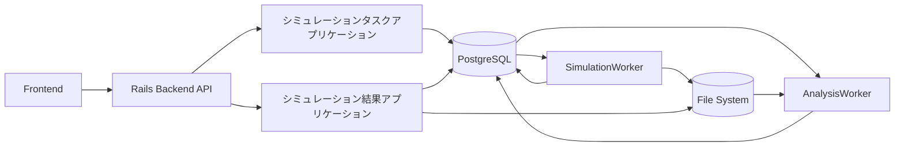
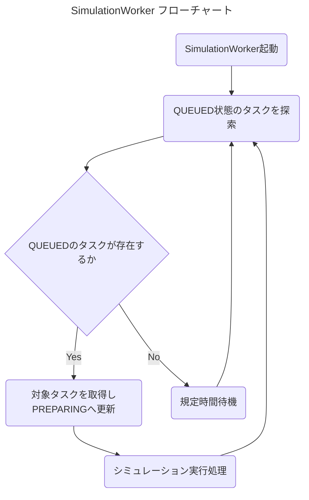
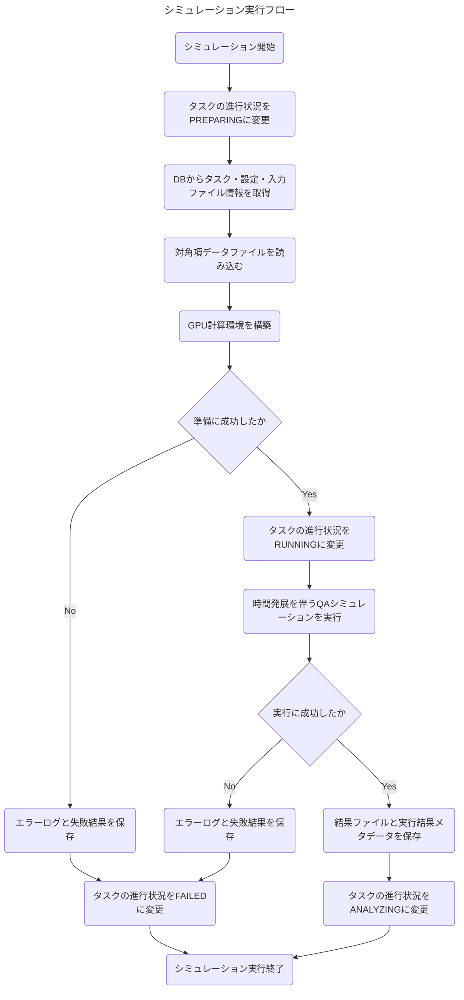
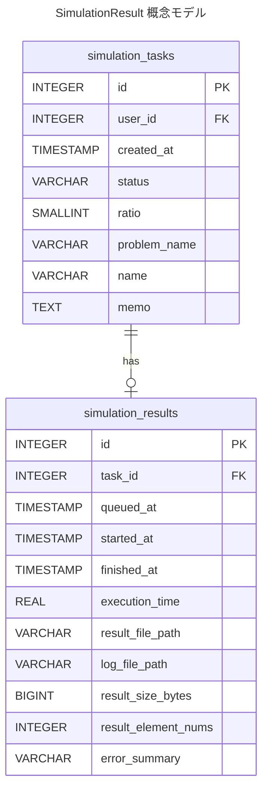
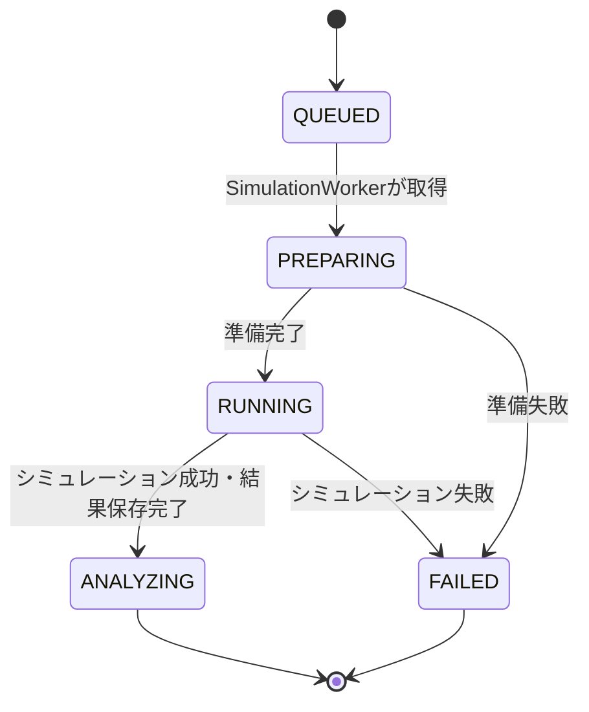
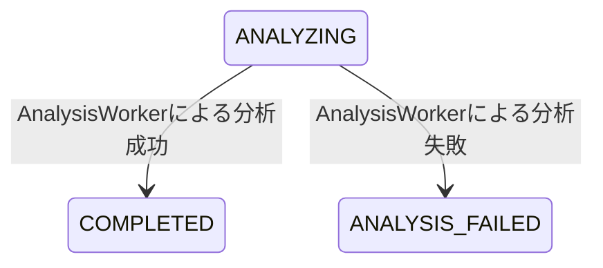

# 概要
本アプリケーションは、DBに登録されたシミュレーションタスクを探索し、タスク情報をもとに量子アニーリングシミュレーションを実行するためのアプリケーションである。  
主な実体は Rust 製の常駐アプリケーションである `SimulationWorker` とする。

QASimLabでは、シミュレーションタスクの作成・確認・編集・削除は `シミュレーションタスクアプリケーション` が担当する。  
シミュレーション結果の分析・表示・ダウンロードは `シミュレーション結果アプリケーション` が担当する。  
本アプリケーションは、それらの中間に位置し、登録済みタスクを実際に実行して、後続処理が参照できる結果ファイルと実行結果メタデータを保存する。

本アプリケーションは、Railsバックエンドから直接呼び出されない。  
`SimulationWorker` はDBを介してタスクを取得し、DBおよびファイルシステムに実行結果を書き込む。

# 用語定義
ここでは、各構成要素を以下のように定義する。

| 用語 | 説明 |
| --- | --- |
| アプリケーション本体 | フロントエンド、およびユーザー・タスク・結果関連APIを提供する Ruby on Rails（API mode）バックエンドアプリケーション |
| SimulationWorker | DB上のシミュレーションタスクを参照し、シミュレーションを実行する Rust 製常駐アプリケーション |
| AnalysisWorker | シミュレーション結果ファイルを分析し、結果サマリーを作成する Rust 製常駐アプリケーション。詳細はシミュレーション結果アプリケーションで扱う |
| 本アプリケーション | SimulationWorker によるタスク探索、シミュレーション実行、結果ファイル保存、失敗ログ保存を扱うアプリケーション領域 |

# 本アプリケーションの責務
本アプリケーションの責務は以下の通りである。

- `QUEUED` 状態のシミュレーションタスクを探索する
- 取得したタスクの状態を `PREPARING`、`RUNNING`、`ANALYZING`、`FAILED` に更新する
- タスクに紐付くシミュレーション設定を取得する
- タスクに紐付く対角項データファイルを読み取る
- Rust 製 GPUQA シミュレータライブラリを用いてシミュレーションを実行する
- シミュレーション成功時に結果ファイルを保存する
- シミュレーション成功時に実行結果メタデータを保存する
- シミュレーション失敗時にエラーログファイルを保存する
- シミュレーション失敗時に失敗メタデータを保存する

# 本アプリケーションが担当しないこと
本アプリケーションは、以下を担当しない。

- ユーザー登録・ログイン・ログアウト
- シミュレーションタスクの作成
- シミュレーションタスクのユーザー向け取得API
- シミュレーションタスクの編集・削除
- シミュレーション結果の分析
- シミュレーション結果サマリーの作成
- シミュレーション結果の画面表示
- シミュレーション結果の `.bin` / `.csv` ダウンロードAPI
- エラーログのユーザー向け表示・ダウンロードAPI

結果の分析・表示・ダウンロードは、別途 `シミュレーション結果アプリケーション` の責務とする。

# 関連アプリケーションとの関係
本アプリケーションは、以下のアプリケーションとDBおよびファイルシステムを介して連携する。



## シミュレーションタスクアプリケーションとの関係
シミュレーションタスクアプリケーションは、ユーザー入力をもとに `SimulationTask`、`SimulationConfig`、`SimulationInputFile` を作成する。  
本アプリケーションは、それらのレコードを読み取り、実行可能なタスクを処理する。

## シミュレーション結果アプリケーションとの関係
本アプリケーションは、シミュレーション成功時に `result.bin` と `SimulationResult` を保存し、タスク状態を `ANALYZING` に変更する。  
その後、シミュレーション結果アプリケーション側の `AnalysisWorker` が `ANALYZING` 状態のタスクを取得し、結果分析を行う。

シミュレーション結果アプリケーションは、分析完了後にタスク状態を `COMPLETED` に変更する。  
したがって、本アプリケーションは正常終了時に `COMPLETED` へは遷移させない。

# Workerが行うこと
`SimulationWorker` は systemd などによって常駐起動され、以下の処理ループを継続的に実行する。



# 本アプリケーションが持つ機能
## タスクキュー探索機能
DB上に登録されている `SimulationTask` のうち、進行状況が `QUEUED` のものを作成日時が古い順に探索する。

取得対象の優先順位は以下の通りとする。

1. `status = QUEUED`
2. `created_at` が古い順
3. `id` が小さい順

`created_at` が同一のタスクが複数存在する場合は、`id` が小さいタスクを先に実行する。

## タスク取得時の排他制御
複数の `SimulationWorker` を同時起動する可能性を考慮し、同一タスクを複数Workerが取得しないように排他制御を行う。

MVPでは `SimulationWorker` は1プロセス運用を想定する。  
ただし、将来的な複数Worker運用に備え、実装上は以下の方針を推奨する。

- DBトランザクション内で対象タスクを取得する
- 対象タスクの状態を `QUEUED` から `PREPARING` に更新する
- 更新に成功したWorkerのみがそのタスクを実行する

PostgreSQLを利用する場合は、将来的に以下のような取得方式を検討する。

```sql
SELECT *
FROM simulation_tasks
WHERE status = 'QUEUED'
ORDER BY created_at ASC, id ASC
FOR UPDATE SKIP LOCKED
LIMIT 1;
```

## シミュレーション設定取得機能
取得した `SimulationTask` に紐付く `SimulationConfig` と `SimulationInputFile` を取得する。

実行に必要な主な情報は以下の通りである。

| 項目 | 取得元 | 説明 |
| --- | --- | --- |
| `dt` | `SimulationConfig` | 単位時間変化量 |
| `tau` | `SimulationConfig` | 終端時間 |
| `b0` | `SimulationConfig` | 初期磁場 |
| `threads` | `SimulationConfig` | GPU計算における1ブロックあたりのスレッド数 |
| `develop_time_method` | `SimulationConfig` | 時間発展メソッド |
| `file_path` | `SimulationInputFile` | 対角項データファイルの保存先 |
| `element_nums` | `SimulationInputFile` | 対角項ベクトルの要素数 |

## 対角項データ読み込み機能
`SimulationInputFile.file_path` に保存された対角項データを読み取る。

対角項データファイルは、シミュレーションタスクアプリケーションによって以下の形式で保存されているものとする。

```text
{root}/bin/{task_id}/input/diagonal_vector.bin
```

| 項目 | 内容 |
| --- | --- |
| ファイル形式 | `.bin` |
| 格納内容 | ハミルトニアンの対角項ベクトル |
| 要素型 | `f64` |
| バイナリ表現 | IEEE 754 binary64 |
| 1要素 | 8 byte |
| ファイルサイズ | `element_nums * 8 byte`（`SimulationInputFile.size_bytes` と一致） |
| 要素数 | `SimulationInputFile.element_nums` と一致 |
| バイトオーダー | リトルエンディアン |

Rust側ではlittle endianの8 byteを1要素として、対角項ベクトルを `f64` の配列として読み込む。

本アプリケーションは、原則として対角項データの形式検証を行わない。  
形式検証はシミュレーションタスクアプリケーションの責務とする。  
ただし、ファイルが存在しない、読み取れない、サイズがメタデータと一致しないなど、実行不能な状態を検出した場合は準備失敗として扱う。

## シミュレーション実行機能
取得した設定値と対角項データをもとに、Rust 製 GPUQA シミュレータライブラリを用いて量子アニーリングシミュレーションを実行する。

シミュレーション実行時には、以下の状態遷移を行う。



## シミュレーション結果保存機能
シミュレーションが正常に完了した場合、`SimulationWorker` は結果ベクトルを以下のパスに `.bin` ファイルとして保存する。

```text
{root}/bin/{task_id}/output/result.bin
```

`{root}` は環境変数から読み取る。  
`task_id` は実行対象の `SimulationTask.id` を使用する。

結果ファイルの形式は以下の通りとする。

| 項目 | 内容 |
| --- | --- |
| ファイル形式 | `.bin` |
| 格納内容 | 各状態に対応する確率値 |
| 要素型 | `f64` |
| 要素数 | 入力された対角項データの要素数と同一 |
| バイトオーダー | リトルエンディアン |

`result.bin` は、状態番号 `i` に対応する確率値を `i` 番目の `f64` 値として保存する。  
したがって、ファイルサイズは原則として以下の値になる。

```text
element_nums * 8 byte
```

`result.bin` の内容分析は本アプリケーションでは行わない。  
確率上位状態の抽出、中央値、実効状態数などの分析は、シミュレーション結果アプリケーションの責務とする。

## 実行結果メタデータ保存機能
シミュレーションが正常に完了した場合、`SimulationWorker` は `SimulationResult` に実行結果メタデータを保存する。

`SimulationResult` はシミュレーション結果アプリケーションで定義されるActive Recordモデルであり、対応する物理テーブルは `simulation_results` である。  
`SimulationWorker` はActive Recordを利用せず、Rails Active Record Migrationによって定義されたこのPostgreSQLテーブルへ直接実行結果を書き込む。

成功時に保存する主な値は以下の通りである。

| 項目 | 説明 |
| --- | --- |
| `task_id` | 実行対象のタスクID |
| `queued_at` | タスクがキューに登録された日時。通常は `SimulationTask.created_at` と同一 |
| `started_at` | `SimulationWorker` が対象タスクの処理を開始した日時 |
| `finished_at` | `SimulationWorker` が対象タスクのシミュレーション実行処理を終了した日時 |
| `execution_time` | シミュレーション本体の実行時間。単位は秒 |
| `result_file_path` | 保存した `result.bin` のパス |
| `log_file_path` | 成功時は `null` |
| `result_size_bytes` | 結果ファイルのサイズ |
| `result_element_nums` | 結果ベクトルの要素数 |
| `error_summary` | 成功時は `null` |

保存後、`SimulationWorker` は `SimulationTask.status` を `ANALYZING` に変更する。  
この状態は、シミュレーション自体は完了しているが、結果分析がまだ完了していないことを表す。

## エラーログ保存機能
シミュレーション準備中または実行中にエラーが発生した場合、`SimulationWorker` はエラーログを以下のパスに保存する。

```text
{root}/bin/{task_id}/log/error.log
```

エラーログには、少なくとも以下の情報を含める。

- 発生日時
- タスクID
- エラー種別
- エラーメッセージ
- 可能であればスタックトレース
- 実行環境情報
  - Workerのバージョン
  - GPUデバイス情報
  - CUDAのバージョン
  - 使用した時間発展メソッド
  - `dt`、`tau`、`b0`、`threads`

## 失敗結果メタデータ保存機能
準備または実行に失敗した場合も、`SimulationWorker` は `SimulationResult` を作成する。

失敗時に保存する主な値は以下の通りである。

| 項目 | 説明 |
| --- | --- |
| `task_id` | 実行対象のタスクID |
| `queued_at` | タスクがキューに登録された日時 |
| `started_at` | `SimulationWorker` が対象タスクの処理を開始した日時 |
| `finished_at` | 失敗処理を終了した日時 |
| `execution_time` | `null`。シミュレーションが正常完了していないため |
| `result_file_path` | `null` |
| `log_file_path` | 保存した `error.log` のパス |
| `result_size_bytes` | `null` |
| `result_element_nums` | `null` |
| `error_summary` | 失敗理由の要約 |

保存後、`SimulationWorker` は `SimulationTask.status` を `FAILED` に変更する。

# 利用するモデル
本アプリケーションは、主に以下のモデルを参照または更新する。  
モデルはRails側のActive Recordで定義する。Workerが依存するのは対応するPostgreSQLの物理スキーマであり、Railsモデルの実行ではない。DBスキーマの実装上の正は Rails Active Record Migration とし、Worker独自のMigrationは管理しない。テーブル名・カラム名・DB型・NULL制約・UNIQUE制約・外部キー・列挙値・日時項目は共通仕様の共有DB契約に従い、Railsと一致させる。以下のモデル名による記述は、対応する物理テーブルのレコードを指す。

| モデル | 定義元 | 本アプリケーションでの扱い |
| --- | --- | --- |
| `SimulationTask` | シミュレーションタスクアプリケーション | 参照・状態更新 |
| `SimulationConfig` | シミュレーションタスクアプリケーション | 参照 |
| `SimulationInputFile` | シミュレーションタスクアプリケーション | 参照 |
| `SimulationResult` | シミュレーション結果アプリケーション | 作成 |

## SimulationTaskの参照・更新項目
本アプリケーションが参照・更新する `SimulationTask` の項目は以下の通りである。

| 項目 | 用途 |
| --- | --- |
| `id` | タスク識別、ファイル保存先の決定 |
| `created_at` | 実行順序の決定、`queued_at` の保存 |
| `status` | 実行対象判定、状態更新 |
| `ratio` | 実行進行割合の更新 |
| `problem_name` | エラーログ等の補助情報として利用可能 |
| `name` | エラーログ等の補助情報として利用可能 |

## SimulationResultの保存内容
`SimulationResult` は、本アプリケーションが作成する実行結果メタデータである。  
ただし、モデルの詳細な定義およびユーザー向けAPIは、シミュレーション結果アプリケーションの仕様書で扱う。

本アプリケーションで必要となる最小項目は以下の通りである。



| 項目 | 型 | 制約 | 説明 |
| --- | --- | --- | --- |
| `id` | int | PK, Auto Increment | シミュレーション結果ID |
| `task` | `SimulationTask` | OneToOne, required | 紐付くシミュレーションタスク |
| `queued_at` | datetime | required | タスクがキューに登録された日時 |
| `started_at` | datetime | required | `SimulationWorker` が処理を開始した日時 |
| `finished_at` | datetime | required | `SimulationWorker` が処理を終了した日時 |
| `execution_time` | float/null | nullable | シミュレーション本体の実行時間。失敗時は `null` |
| `result_file_path` | string/null | nullable, max_length=512 | 成功時に保存される結果ファイルのパス |
| `log_file_path` | string/null | nullable, max_length=512 | 失敗時に保存されるログファイルのパス |
| `result_size_bytes` | int/null | nullable | 結果ファイルのサイズ。成功時のみ値を持つ |
| `result_element_nums` | int/null | nullable | 結果ベクトルの要素数。成功時のみ値を持つ |
| `error_summary` | string/null | nullable, max_length=512 | 失敗理由の要約。成功時は `null` |

# ファイル保存先
シミュレーションに関連するファイルは、共通仕様に従い `{root}/bin/{task_id}/` 配下に保存する。  
`{root}` は環境変数から読み取る。

本アプリケーションが直接作成するファイルは以下の通りである。

```text
{root}/bin/{task_id}/output/result.bin
{root}/bin/{task_id}/log/error.log
```

また、本アプリケーションは以下の入力ファイルを読み取る。

```text
{root}/bin/{task_id}/input/diagonal_vector.bin
```

| パス | 作成者 | 本アプリケーションでの扱い | 説明 |
| --- | --- | --- | --- |
| `{root}/bin/{task_id}/input/diagonal_vector.bin` | シミュレーションタスクアプリケーション | 読み取り | シミュレーションに使用する対角項データ |
| `{root}/bin/{task_id}/output/result.bin` | 本アプリケーション | 作成 | シミュレーション成功時に保存される結果データ |
| `{root}/bin/{task_id}/log/error.log` | 本アプリケーション | 作成 | シミュレーション失敗時に保存されるエラーログ |

# 結果ファイルについて
`result.bin` は、状態番号に対応する確率値を `f64` の連続データとして保存するバイナリファイルである。

例えば、状態数が4の場合、以下のようなデータを保存する。

| 状態番号 | 確率 |
| --- | --- |
| 0 | 0.1 |
| 1 | 0.2 |
| 2 | 0.6 |
| 3 | 0.1 |

この場合、`result.bin` には以下の順序で `f64` 値が保存される。

```text
0.1, 0.2, 0.6, 0.1
```

`result_element_nums` は入力ファイルの `element_nums` と一致する必要がある。  
`result_size_bytes` は `result_element_nums * 8` と一致する必要がある。

# エラーログファイルについて
エラーログファイルは、`SimulationWorker` が処理に失敗した理由を調査するためのファイルである。

MVPでは、エラーログはプレーンテキスト形式とし、以下のような構造で記録する。

```text
[summary]
task_id=1
status=FAILED
failed_at=2026-05-07T18:09:32
error_type=SimulationRuntimeError
message=GPU calculation failed

[config]
dt=0.001
tau=20.0
b0=10.0
threads=32
develop_time_method=AUTO

[environment]
worker_version=0.1.0
gpu_name=NVIDIA GeForce RTX 3090 Ti
cuda_version=12.5

[detail]
...
```

画面表示用の失敗要約には `SimulationResult.error_summary` を利用する。  
詳細な調査が必要な場合は、シミュレーション結果アプリケーションを通じてログファイル本文を確認する。

# 状態遷移
本アプリケーションが関与する状態遷移は以下の通りである。



`ANALYZING` 以降の状態遷移は、シミュレーション結果アプリケーションが担当する。



`SimulationWorker` は、ユーザー操作による `CANCELED` 状態のタスクを実行対象にしない。

| 変更前 | 変更後 | 実行者 | 説明 |
| --- | --- | --- | --- |
| `QUEUED` | `PREPARING` | `SimulationWorker` | Worker がタスクを取得した |
| `PREPARING` | `RUNNING` | `SimulationWorker` | 入力データ読み込みとGPU計算環境の構築が完了した |
| `PREPARING` | `FAILED` | `SimulationWorker` | 実行準備に失敗した |
| `RUNNING` | `ANALYZING` | `SimulationWorker` | シミュレーションが正常終了し、結果ファイルと実行結果メタデータの保存が完了した |
| `RUNNING` | `FAILED` | `SimulationWorker` | シミュレーション実行中に失敗した |

# API
本アプリケーションは、ユーザー向けAPIを持たない。  
タスク作成・取得・編集・削除APIはシミュレーションタスクアプリケーションが提供する。  
結果表示・分析結果取得・結果ファイルダウンロード・ログ表示APIはシミュレーション結果アプリケーションが提供する。

`SimulationWorker` は、RailsバックエンドのAPIを呼び出さず、DBを直接参照・更新する。

# 権限
本アプリケーションはユーザーから直接操作されないため、ユーザー権限判定を行わない。  
ただし、DB接続ユーザーには必要最小限の権限のみを付与することが望ましい。

MVPでは、実装簡略化のため、`SimulationWorker` は以下の操作が可能なDBユーザーを利用する。

| 対象 | 操作 |
| --- | --- |
| `SimulationTask` | SELECT, UPDATE |
| `SimulationConfig` | SELECT |
| `SimulationInputFile` | SELECT |
| `SimulationResult` | INSERT, SELECT |

将来的には、Worker専用DBユーザーを作成し、ユーザー管理系テーブルなど不要なテーブルへの書き込み権限を与えない構成を検討する。

# Worker設定
`SimulationWorker` は環境変数または設定ファイルから以下の値を取得する。

| 項目 | 説明 |
| --- | --- |
| `QASIM_ROOT` | シミュレーション関連ファイルのルートディレクトリ |
| `DATABASE_URL` | PostgreSQL接続先 |
| `SIMULATION_WORKER_POLL_INTERVAL_SECONDS` | キューが空の場合に待機する秒数 |
| `SIMULATION_WORKER_VERSION` | SimulationWorkerのバージョン |
| `CUDA_ARCH` | CUDAコンパイル時に使用するアーキテクチャ指定 |
| `LOG_LEVEL` | Workerログの出力レベル |

MVPでは、`SimulationWorker` は1プロセス1台のサーバー上で動作する前提とする。

# 実装上の注意
## トランザクション
`SimulationWorker` は、タスク状態の更新と `SimulationResult` の保存を整合性が崩れないように行う必要がある。

特に、以下の処理はトランザクション境界を明確にする。

1. `QUEUED` のタスクを取得する
2. 対象タスクを `PREPARING` に更新する
3. 実行準備が完了したら `RUNNING` に更新する
4. 成功時は結果ファイルを保存する
5. `SimulationResult` を作成する
6. タスクを `ANALYZING` に更新する

失敗時は以下の通りとする。

1. エラーログファイルを保存する
2. 失敗内容を含む `SimulationResult` を作成する
3. タスクを `FAILED` に更新する

ファイル保存とDBトランザクションは完全には一体化できない。  
そのため、ファイル保存後にDB更新へ失敗した場合、またはDB更新後にファイル操作へ失敗した場合に備え、Workerログを記録し、後続の復旧処理で不整合を検出できるようにする。

## `SimulationResult` 作成タイミング
成功時の `SimulationResult` は、`result.bin` の保存完了後、タスク状態を `ANALYZING` に変更する前に作成する。  
これにより、`AnalysisWorker` は `ANALYZING` 状態のタスクを取得した時点で、対応する `SimulationResult.result_file_path` を参照できる。

失敗時の `SimulationResult` は、`error.log` の保存完了後、タスク状態を `FAILED` に変更する前に作成する。

## 実行時間の計測範囲
`execution_time` は、シミュレーション本体の実行時間を秒単位で記録する。

以下は `execution_time` に含めない。

- DBからのタスク取得時間
- 対角項データファイルの読み込み時間
- GPU計算環境の初期化時間
- CUDAカーネルのコンパイル時間
- 結果ファイルの保存時間
- `SimulationResult` の保存時間

以下は `execution_time` に含める。

- 時間発展計算
- ノルム計算
- 正規化処理
- シミュレーション本体に含まれるGPU計算

## 進行割合の更新
`SimulationWorker` は、実行中のタスクについて `SimulationTask.ratio` を更新してよい。

MVPでは、最低限以下の更新を行う。

| タイミング | ratio |
| --- | --- |
| タスク作成時 | 0 |
| `PREPARING` への変更時 | 0 |
| `RUNNING` への変更時 | 0 |
| シミュレーション中 | 可能であれば 1〜99 |
| `ANALYZING` への変更時 | 100 |
| `FAILED` への変更時 | 直前の値を維持、または 0 |

進行割合を高頻度にDB更新すると負荷が増えるため、更新間隔を制限する。

## Worker異常終了時の扱い
`SimulationWorker` が `PREPARING` または `RUNNING` の状態で異常終了した場合、タスクが中間状態のまま残る可能性がある。

MVPでは、異常終了タスクの自動復旧は必須としない。  
後続実装として、以下を検討する。

- `PREPARING` または `RUNNING` のまま一定時間更新されていないタスクを検出する
- 管理者操作で `FAILED` または `QUEUED` に戻す
- Worker起動時に中断タスクを検出し、復旧ポリシーに従って処理する

## DBとファイルの不整合
以下のような不整合が発生する可能性がある。

- `result.bin` は存在するが、`SimulationResult` が存在しない
- `SimulationResult.result_file_path` は存在するが、実体ファイルが存在しない
- `error.log` は存在するが、`SimulationResult` が存在しない
- `SimulationResult.log_file_path` は存在するが、実体ファイルが存在しない
- 結果ファイルのサイズが `result_size_bytes` と一致しない
- 結果ファイルの要素数が `result_element_nums` と一致しない

MVPでは、不整合が発生した場合はWorkerログに記録する。  
不整合の検出・修復用の管理機能は後続実装とする。

## シミュレーション以外の負荷削減
本アプリケーションでは、`SimulationWorker` の責務をシミュレーション実行に集中させる。  
そのため、結果ファイルの分析、上位状態の抽出、中央値計算、実効状態数計算などは行わない。

`SimulationWorker` が成功時に行う後処理は、以下の最小限に留める。

- `result.bin` の保存
- `SimulationResult` の作成
- `SimulationTask.status` の `ANALYZING` への更新

# MVPで実装する範囲
本アプリケーションのMVPでは、以下を実装対象とする。

- `SimulationWorker` による `QUEUED` タスク探索
- `SimulationWorker` によるタスク状態更新
- `SimulationConfig` の読み取り
- `SimulationInputFile` の読み取り
- 対角項データファイルの読み込み
- Rust 製 GPUQA シミュレータライブラリを用いたシミュレーション実行
- 成功時の `result.bin` 保存
- 成功時の `SimulationResult` 作成
- 成功時の `ANALYZING` への状態更新
- 失敗時の `error.log` 保存
- 失敗時の `SimulationResult` 作成
- 失敗時の `FAILED` への状態更新
- Workerログ出力
- systemd による常駐起動

以下は、必要に応じて後続実装とする。

- 複数 `SimulationWorker` の本格的な排他制御
- 実行中タスクの強制停止
- Worker異常終了時のタスク自動復旧
- DB・ファイル不整合の検出および修復機能
- 結果ファイルの圧縮
- GPU複数枚利用への対応
- Worker専用DBユーザーの権限制御強化
