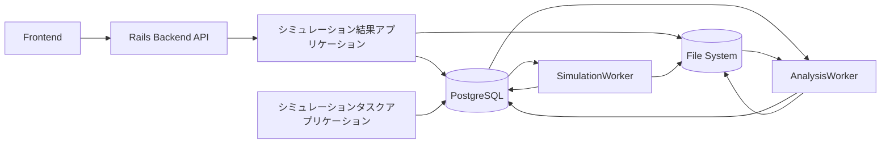
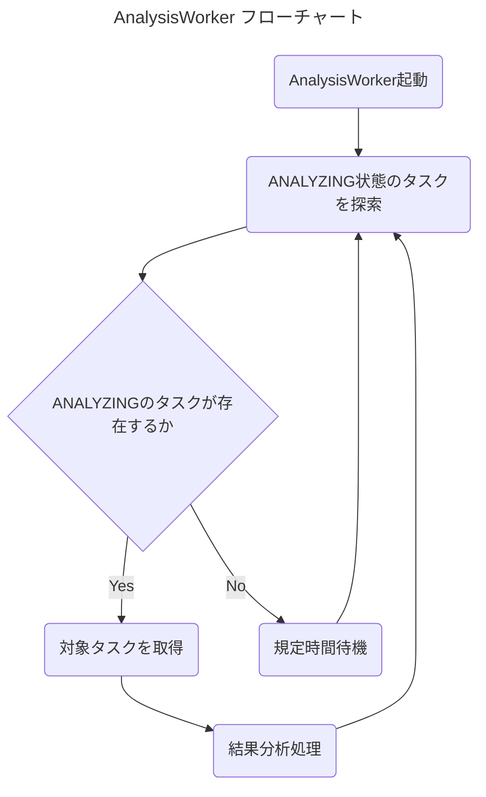
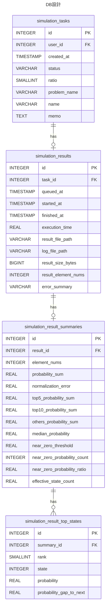
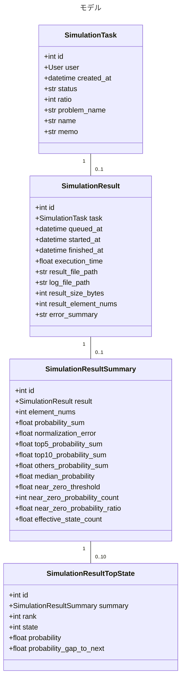
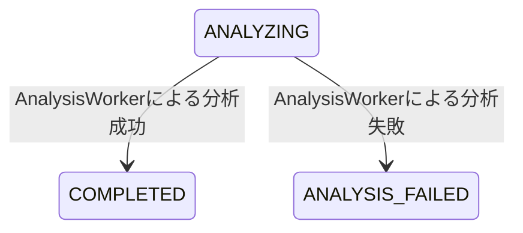
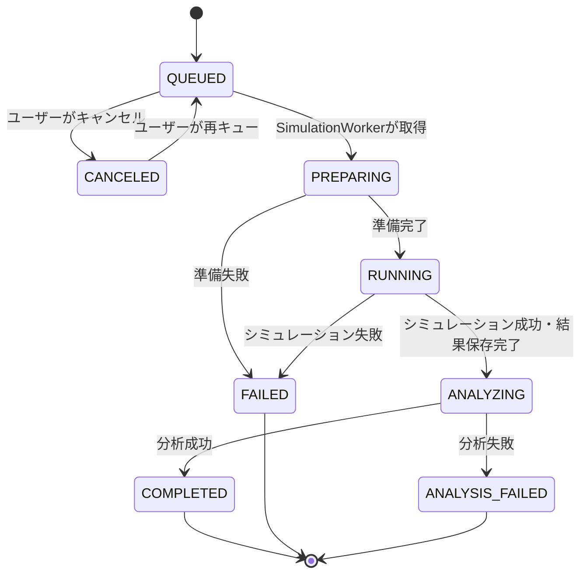

# 概要
本アプリケーションは、シミュレーション実行アプリケーションによって保存されたシミュレーション結果を分析し、ユーザーが結果を確認・取得できるようにするためのアプリケーションである。  
主な実体は、結果分析を行う Rust 製の常駐アプリケーションである `AnalysisWorker` と、結果表示・ダウンロードAPIを提供する Ruby on Rails（API mode）バックエンドである。

QASimLabでは、シミュレーションタスクの作成・確認・編集・削除は `シミュレーションタスクアプリケーション` が担当する。  
シミュレーションの実行、結果ファイル保存、失敗ログ保存は `シミュレーション実行アプリケーション` が担当する。  
本アプリケーションは、シミュレーション実行後の結果分析、分析結果の保存、結果表示、結果ファイルおよびログファイルの提供を担当する。

シミュレーション結果の分析は、シミュレーション実行処理とは分離して行う。  
これにより、`SimulationWorker` はシミュレーション完了後に次のタスク探索へ戻ることができ、結果分析によってシミュレーション実行処理が待たされることを避ける。

# 用語定義
ここでは、各構成要素を以下のように定義する。

| 用語 | 説明 |
| --- | --- |
| アプリケーション本体 | フロントエンド、およびユーザー・タスク・結果関連APIを提供する Ruby on Rails（API mode）バックエンドアプリケーション |
| SimulationWorker | DB上のシミュレーションタスクを参照し、シミュレーションを実行する Rust 製常駐アプリケーション。詳細はシミュレーション実行アプリケーションで扱う |
| AnalysisWorker | シミュレーション結果ファイルを分析し、結果サマリーを作成する Rust 製常駐アプリケーション |
| SimulationResult | シミュレーション実行結果のメタデータ。結果ファイルパス、ログファイルパス、実行時間などを保持する |
| SimulationResultSummary | シミュレーション結果ファイルから計算された分析サマリー |
| SimulationResultTopState | 確率上位状態の分析結果 |
| 本アプリケーション | AnalysisWorker による結果分析、結果メタデータ・分析結果の管理、結果表示・ダウンロードAPIを扱うアプリケーション領域 |

# 本アプリケーションの責務
本アプリケーションの責務は以下の通りである。

- `ANALYZING` 状態のシミュレーションタスクを探索する
- 対応する `SimulationResult` を取得する
- `result.bin` を読み取り、結果分析を行う
- 分析結果として `SimulationResultSummary` を作成する
- 確率上位状態として `SimulationResultTopState` を作成する
- 分析成功時に `SimulationTask.status` を `COMPLETED` に変更する
- 分析失敗時に `SimulationTask.status` を `ANALYSIS_FAILED` に変更する
- 分析失敗時に分析エラーログを保存する
- ユーザー向けに結果メタデータ、分析サマリー、上位状態を返却する
- ユーザー向けに結果ファイルを `.bin` または `.csv` 形式で提供する
- ユーザー向けにシミュレーション失敗ログまたは分析失敗ログを提供する

# 本アプリケーションが担当しないこと
本アプリケーションは、以下を担当しない。

- ユーザー登録・ログイン・ログアウト
- シミュレーションタスクの作成
- シミュレーションタスクの編集・削除
- 対角項データの登録・置き換え
- 量子アニーリングシミュレーション本体の実行
- `result.bin` の生成
- シミュレーション実行失敗時の `SimulationResult` 作成
- シミュレーション実行失敗時の `FAILED` への状態更新

シミュレーション実行および結果ファイル保存は、別途 `シミュレーション実行アプリケーション` の責務とする。

# 関連アプリケーションとの関係
本アプリケーションは、以下のアプリケーションとDBおよびファイルシステムを介して連携する。



## シミュレーション実行アプリケーションとの関係
シミュレーション実行アプリケーションは、シミュレーション成功時に以下を行う。

- `{root}/bin/{task_id}/output/result.bin` を保存する
- `SimulationResult` を作成する
- `SimulationTask.status` を `ANALYZING` に変更する

本アプリケーションの `AnalysisWorker` は、`ANALYZING` 状態のタスクを取得し、対応する `SimulationResult.result_file_path` を読み取って分析を行う。

## シミュレーションタスクアプリケーションとの関係
本アプリケーションは、結果表示時に `SimulationTask` の情報を参照する。  
たとえば、結果ファイルのダウンロード名を生成する際には、`problem_name` と `name` を利用する。

本アプリケーションは、ユーザー操作によるタスク作成・編集・削除を行わない。

# AnalysisWorkerが行うこと
`AnalysisWorker` は systemd などによって常駐起動され、以下の処理ループを継続的に実行する。



# 本アプリケーションが持つ機能
## 分析対象探索機能
DB上に登録されている `SimulationTask` のうち、進行状況が `ANALYZING` のものを作成日時が古い順に探索する。

取得対象の優先順位は以下の通りとする。

1. `status = ANALYZING`
2. `created_at` が古い順
3. `id` が小さい順

`created_at` が同一のタスクが複数存在する場合は、`id` が小さいタスクを先に分析する。

## 分析対象取得時の排他制御
複数の `AnalysisWorker` を同時起動する可能性を考慮し、同一タスクを複数Workerが同時に分析しないように排他制御を行う。

MVPでは `AnalysisWorker` は1プロセス運用を想定する。  
ただし、将来的な複数Worker運用に備え、実装上は以下の方針を推奨する。

- DBトランザクション内で対象タスクを取得する
- 対象タスクの状態を確認する
- 対象タスクに紐付く `SimulationResult` を取得する
- 同時取得が起きないように行ロックを利用する

PostgreSQLを利用する場合は、将来的に以下のような取得方式を検討する。

```sql
SELECT *
FROM simulation_tasks
WHERE status = 'ANALYZING'
ORDER BY created_at ASC, id ASC
FOR UPDATE SKIP LOCKED
LIMIT 1;
```

## 結果ファイル読み取り機能
`AnalysisWorker` は、`SimulationResult.result_file_path` に保存された結果ファイルを読み取る。

結果ファイルは、シミュレーション実行アプリケーションによって以下の形式で保存されているものとする。

```text
{root}/bin/{task_id}/output/result.bin
```

| 項目 | 内容 |
| --- | --- |
| ファイル形式 | `.bin` |
| 格納内容 | 各状態に対応する確率値 |
| 要素型 | `f64` |
| 要素数 | `SimulationResult.result_element_nums` と一致 |
| バイトオーダー | リトルエンディアン |

`result.bin` は、状態番号 `i` に対応する確率値を `i` 番目の `f64` 値として保存する。

## 結果ファイル検証機能
`AnalysisWorker` は、分析前に最低限以下の検証を行う。

| 項目 | 内容 |
| --- | --- |
| ファイル存在確認 | `result_file_path` に実体ファイルが存在すること |
| ファイル読み取り確認 | ファイルが読み取り可能であること |
| ファイルサイズ確認 | `result_size_bytes` と実体ファイルサイズが一致すること |
| 要素数確認 | `result_size_bytes = result_element_nums * 8` を満たすこと |
| 確率値確認 | 読み取った値が `NaN` または無限大でないこと |

確率値が負の値を含む場合は、分析失敗として扱う。  
確率合計が1から多少ずれることは、浮動小数点誤差として許容する。ズレの大きさは `normalization_error` として保存する。

## 結果分析機能
`AnalysisWorker` は、結果ファイルを読み取り、画面表示および結果評価に必要な要約統計を計算する。

最適化問題では、対称性により異なる状態番号が実質的に同一の最適解を表す場合がある。  
そのため、本アプリケーションでは `top1` と `top2` の比較のみを主要な評価指標とはしない。  
代わりに、上位5件・上位10件の確率合計、および上位10件以外の確率合計を用いて、上位候補群への確率集中度を評価できるようにする。

また、シミュレーション設定や対角項データが不適切な場合、確率分布がほぼ一様に近い結果となる可能性がある。  
その検出補助として、中央値、0付近の状態数、実効状態数を保存する。

## 分析項目
`AnalysisWorker` が計算する標準分析項目は以下の通りである。

| 項目 | 説明 |
| --- | --- |
| `element_nums` | 状態数 |
| `probability_sum` | 全状態の確率合計 |
| `normalization_error` | `abs(1.0 - probability_sum)` |
| `top5_probability_sum` | 確率上位5件の合計 |
| `top10_probability_sum` | 確率上位10件の合計 |
| `others_probability_sum` | 上位10件以外の確率合計 |
| `median_probability` | 確率の中央値 |
| `near_zero_threshold` | 0付近判定に使用した閾値 |
| `near_zero_probability_count` | `near_zero_threshold` 未満の確率を持つ状態数 |
| `near_zero_probability_ratio` | `near_zero_probability_count / element_nums` |
| `effective_state_count` | `1 / Σ p_i^2` で定義される実効状態数 |

MVPでは、平均値、最大値、最小値、倍率系指標は標準分析項目に含めない。

## 0付近判定の閾値
`near_zero_probability_count` は、アプリケーションが定める標準閾値未満の確率を持つ状態数とする。

MVPでは、標準閾値を以下の式で定義する。

```text
near_zero_threshold = 0.01 / element_nums
```

これは、一様分布時の平均確率 `1 / element_nums` の1%未満を0付近とみなす基準である。

分析結果には、実際に使用した `near_zero_threshold` を保存する。  
これにより、将来的に閾値の定義を変更した場合でも、過去の分析値がどの基準で計算されたかを確認できる。

ユーザーが任意の閾値を指定して再分析する機能は、MVPでは実装しない。  
後続実装として、詳細分析APIまたは再分析機能で対応を検討する。

## 上位状態抽出機能
`AnalysisWorker` は、確率が高い上位10件の状態を抽出し、`SimulationResultTopState` として保存する。

保存する項目は以下の通りである。

| 項目 | 説明 |
| --- | --- |
| `rank` | 確率順位。1始まり |
| `state` | 状態番号 |
| `probability` | 該当状態の確率 |
| `probability_gap_to_next` | 一つ下位の順位との確率差 |

`rank = 10` の `probability_gap_to_next` を計算するため、内部的には上位11件を抽出する。  
DBに保存するのは上位10件のみとする。

全状態をソートする必要はない。  
実装では、固定長ヒープなどを利用して、全要素を走査しながら上位11件のみを保持する方式を推奨する。

## 分析結果保存機能
分析に成功した場合、`AnalysisWorker` は以下の処理を行う。

1. `SimulationResultSummary` を作成する
2. `SimulationResultTopState` を上位10件分作成する
3. `SimulationTask.status` を `COMPLETED` に変更する

`COMPLETED` は、シミュレーション実行と標準分析の両方が完了した状態を表す。

## 分析失敗ログ保存機能
分析中にエラーが発生した場合、`AnalysisWorker` は分析エラーログを以下のパスに保存する。

```text
{root}/bin/{task_id}/log/analysis_error.log
```

分析エラーログには、少なくとも以下の情報を含める。

- 発生日時
- タスクID
- SimulationResult ID
- エラー種別
- エラーメッセージ
- 可能であればスタックトレース
- 結果ファイル情報
  - `result_file_path`
  - `result_size_bytes`
  - `result_element_nums`
- AnalysisWorkerの実行環境情報
  - Workerのバージョン
  - OS情報
  - 使用した分析ロジックのバージョン

## 分析失敗時の状態更新
分析に失敗した場合、`AnalysisWorker` は `SimulationTask.status` を `ANALYSIS_FAILED` に変更する。

`ANALYSIS_FAILED` は、シミュレーション自体は成功しているが、結果サマリー作成に失敗した状態を表す。  
この状態では、`result.bin` のダウンロードは可能とする。  
ただし、分析サマリーおよび上位状態一覧は表示できない。

分析失敗は、シミュレーション実行失敗とは区別する。  
したがって、`SimulationTask.status` を `FAILED` には変更しない。

# 結果表示機能
ユーザーは、シミュレーションタスク一覧画面またはタスク詳細画面から、シミュレーション結果表示画面に遷移できる。

結果表示画面では、タスクの状態に応じて以下を表示する。

| タスク状態 | 表示内容 |
| --- | --- |
| `QUEUED` | 実行待ちであり、結果は未作成であること |
| `PREPARING` | 実行準備中であり、結果は未作成であること |
| `RUNNING` | シミュレーション実行中であり、結果は未作成であること |
| `ANALYZING` | シミュレーションは完了しており、分析中であること。結果ファイルのダウンロードは可能 |
| `COMPLETED` | 結果サマリー、上位状態一覧、結果ファイルダウンロードを表示 |
| `FAILED` | シミュレーション実行に失敗したこと。失敗要約と実行エラーログを表示 |
| `ANALYSIS_FAILED` | シミュレーションは成功したが分析に失敗したこと。結果ファイルと分析エラーログを表示 |
| `CANCELED` | 実行キャンセル済みであり、結果は未作成であること |

## 完了結果の表示内容
`COMPLETED` 状態の結果画面では、少なくとも以下を表示する。

- タスク情報
  - タスクID
  - 作成ユーザー
  - 作成日時
  - 最適化問題名
  - タスク名
  - メモ
- 実行結果メタデータ
  - キュー登録日時
  - 実行開始日時
  - 実行終了日時
  - 実行時間
  - 結果ファイルサイズ
  - 結果要素数
- 結果サマリー
  - 確率合計
  - 正規化誤差
  - 上位5件の確率合計
  - 上位10件の確率合計
  - 上位10件以外の確率合計
  - 中央値
  - 0付近判定閾値
  - 0付近状態数
  - 0付近状態割合
  - 実効状態数
- 上位状態一覧
  - 順位
  - 状態番号
  - 確率
  - 一つ下位との差

MVPでは、全状態を一括でグラフ表示しない。  
状態数が `2^20` 以上になる場合、全状態の棒グラフ表示は描画負荷・通信負荷が大きいためである。  
ユーザーは、上位状態一覧および分析サマリーを用いて結果を評価し、必要に応じて結果ファイルをダウンロードして詳細分析を行う。

# モデル
以下に、本アプリケーションで扱うモデルの定義について記述する。  
バックエンドのモデルは Active Record で定義する。以下のER図はPostgreSQLの物理テーブル、モデル表・クラス図は属性と関連を表す。DBスキーマの実装上の正は Rails Active Record Migration とし、共通仕様の共有DB契約に従う。

本アプリケーションでは、以下のモデルを定義する。

`AnalysisWorker` はRails APIやActive Recordを利用せず、Rails Active Record Migrationによって定義されたPostgreSQLテーブルを直接参照・更新する。Worker側で別のMigrationは管理しない。テーブル名・カラム名・DB型・NULL制約・UNIQUE制約・外部キー・列挙値・日時項目は共通仕様の共有DB契約に従い、Railsと一致させる。Workerの処理におけるモデル名は対応する物理テーブルのレコードを指す。Backend APIとの連携はPostgreSQLおよびファイルシステムを介して行い、直接通信しない。

- `SimulationResult` : シミュレーション実行結果のメタデータ
- `SimulationResultSummary` : シミュレーション結果の分析サマリー
- `SimulationResultTopState` : 確率上位状態

## DB設計


## SimulationResult
`SimulationResult` は、シミュレーション実行結果のメタデータを保持するモデルである。  
このモデルは本アプリケーションで定義するが、レコードの作成は主に `SimulationWorker` が行う。

| 項目 | 型 | 制約 | 説明 |
| --- | --- | --- | --- |
| `id` | int | PK, Auto Increment | シミュレーション結果ID |
| `task` | `SimulationTask` | OneToOne, required | 紐付くシミュレーションタスク |
| `queued_at` | datetime | required | タスクがキューに登録された日時 |
| `started_at` | datetime | required | `SimulationWorker` が処理を開始した日時 |
| `finished_at` | datetime | required | `SimulationWorker` が処理を終了した日時 |
| `execution_time` | float/null | nullable | シミュレーション本体の実行時間。失敗時は `null` |
| `result_file_path` | string/null | nullable, max_length=512 | 成功時に保存される結果ファイルのパス |
| `log_file_path` | string/null | nullable, max_length=512 | 失敗時に保存されるログファイルのパス |
| `result_size_bytes` | int/null | nullable | 結果ファイルのサイズ。成功時のみ値を持つ |
| `result_element_nums` | int/null | nullable | 結果ベクトルの要素数。成功時のみ値を持つ |
| `error_summary` | string/null | nullable, max_length=512 | 失敗理由の要約。成功時は `null` |

## SimulationResultSummary
`SimulationResultSummary` は、`result.bin` を分析して得られた要約統計を保持するモデルである。  
`AnalysisWorker` が作成する。

| 項目 | 型 | 制約 | 説明 |
| --- | --- | --- | --- |
| `id` | int | PK, Auto Increment | 結果サマリーID |
| `result` | `SimulationResult` | OneToOne, required | 紐付くシミュレーション結果 |
| `element_nums` | int | required, 0より大きい | 状態数 |
| `probability_sum` | float | required | 全状態の確率合計 |
| `normalization_error` | float | required, 0以上 | `abs(1.0 - probability_sum)` |
| `top5_probability_sum` | float | required, 0以上 | 上位5件の確率合計 |
| `top10_probability_sum` | float | required, 0以上 | 上位10件の確率合計 |
| `others_probability_sum` | float | required, 0以上 | 上位10件以外の確率合計 |
| `median_probability` | float | required, 0以上 | 確率の中央値 |
| `near_zero_threshold` | float | required, 0以上 | 0付近判定に使用した閾値 |
| `near_zero_probability_count` | int | required, 0以上 | 0付近と判定された状態数 |
| `near_zero_probability_ratio` | float | required, 0以上1以下 | 0付近状態数の割合 |
| `effective_state_count` | float | required, 1以上 | 実効状態数 |

## SimulationResultTopState
`SimulationResultTopState` は、確率上位状態を保持するモデルである。  
`AnalysisWorker` が作成する。

| 項目 | 型 | 制約 | 説明 |
| --- | --- | --- | --- |
| `id` | int | PK, Auto Increment | 上位状態ID |
| `summary` | `SimulationResultSummary` | FK, required | 紐付く結果サマリー |
| `rank` | int | required, 1以上10以下 | 確率順位 |
| `state` | int | required, 0以上 | 状態番号 |
| `probability` | float | required, 0以上 | 該当状態の確率 |
| `probability_gap_to_next` | float/null | nullable, 0以上 | 一つ下位の順位との確率差 |

`rank` は、同一 `summary` 内で一意とする。  
`state` も、同一 `summary` 内で一意とする。

## クラス図


# ファイル保存先
シミュレーションに関連するファイルは、共通仕様に従い `{root}/bin/{task_id}/` 配下に保存する。  
`{root}` は環境変数から読み取る。

本アプリケーションが読み取る、または作成するファイルは以下の通りである。

```text
{root}/bin/{task_id}/output/result.bin
{root}/bin/{task_id}/log/error.log
{root}/bin/{task_id}/log/analysis_error.log
```

| パス | 作成者 | 本アプリケーションでの扱い | 説明 |
| --- | --- | --- | --- |
| `{root}/bin/{task_id}/output/result.bin` | シミュレーション実行アプリケーション | 読み取り・ダウンロード提供 | シミュレーション成功時に保存される結果データ |
| `{root}/bin/{task_id}/log/error.log` | シミュレーション実行アプリケーション | 読み取り・ダウンロード提供 | シミュレーション失敗時に保存されるエラーログ |
| `{root}/bin/{task_id}/log/analysis_error.log` | 本アプリケーション | 作成・読み取り・ダウンロード提供 | 分析失敗時に保存されるエラーログ |

# 状態遷移
本アプリケーションが関与する状態遷移は以下の通りである。



QASimLab全体の状態遷移は以下の通りである。



| 変更前 | 変更後 | 実行者 | 説明 |
| --- | --- | --- | --- |
| `ANALYZING` | `COMPLETED` | `AnalysisWorker` | 結果分析が正常終了した |
| `ANALYZING` | `ANALYSIS_FAILED` | `AnalysisWorker` | 結果分析に失敗した |

# API
本アプリケーションが実装する全てのAPIは `api/result/` から始まる。  
失敗時のレスポンス形式は共通仕様に従い、同じステータスコードで複数種類のエラーを返す場合は以下の形式で返却する。

```json
{
    "code": "ERROR_CODE",
    "message": "エラー内容"
}
```

## 結果概要取得API
タスクIDをもとに、結果画面の初期表示に必要な情報を返却するAPI。  
タスク状態に応じて、実行結果メタデータ、分析サマリー、失敗情報を返却する。

- URL: `api/result/{task_id}`
- メソッド: `GET`
- 認証: 不要

### 成功時
ステータスコード: 200 OK

`COMPLETED` の場合:

```json
{
    "task": {
        "id": 1,
        "user": {
            "student_id": "B1234567",
            "name": "山田太郎"
        },
        "created_at": "2026-05-07T18:09:32",
        "status": "COMPLETED",
        "problem_name": "整数分割問題",
        "name": "サンプルタスク",
        "memo": "テスト実行"
    },
    "result": {
        "id": 1,
        "queued_at": "2026-05-07T18:09:32",
        "started_at": "2026-05-07T18:10:00",
        "finished_at": "2026-05-07T18:10:12",
        "execution_time": 10.51,
        "result_size_bytes": 8388608,
        "result_element_nums": 1048576
    },
    "summary": {
        "element_nums": 1048576,
        "probability_sum": 0.9999999998,
        "normalization_error": 0.0000000002,
        "top5_probability_sum": 0.8364,
        "top10_probability_sum": 0.8912,
        "others_probability_sum": 0.1088,
        "median_probability": 0.0000000012,
        "near_zero_threshold": 0.0000000095,
        "near_zero_probability_count": 1030000,
        "near_zero_probability_ratio": 0.9823,
        "effective_state_count": 1.87
    }
}
```

`ANALYZING` の場合:

```json
{
    "task": {
        "id": 1,
        "status": "ANALYZING",
        "problem_name": "整数分割問題",
        "name": "サンプルタスク"
    },
    "result": {
        "id": 1,
        "queued_at": "2026-05-07T18:09:32",
        "started_at": "2026-05-07T18:10:00",
        "finished_at": "2026-05-07T18:10:12",
        "execution_time": 10.51,
        "result_size_bytes": 8388608,
        "result_element_nums": 1048576
    },
    "summary": null,
    "message": "シミュレーションは完了しています。現在、結果分析中です。"
}
```

`FAILED` の場合:

```json
{
    "task": {
        "id": 1,
        "status": "FAILED",
        "problem_name": "整数分割問題",
        "name": "サンプルタスク"
    },
    "result": {
        "id": 1,
        "queued_at": "2026-05-07T18:09:32",
        "started_at": "2026-05-07T18:10:00",
        "finished_at": "2026-05-07T18:10:01",
        "execution_time": null,
        "error_summary": "GPU calculation failed"
    },
    "summary": null
}
```

`ANALYSIS_FAILED` の場合:

```json
{
    "task": {
        "id": 1,
        "status": "ANALYSIS_FAILED",
        "problem_name": "整数分割問題",
        "name": "サンプルタスク"
    },
    "result": {
        "id": 1,
        "queued_at": "2026-05-07T18:09:32",
        "started_at": "2026-05-07T18:10:00",
        "finished_at": "2026-05-07T18:10:12",
        "execution_time": 10.51,
        "result_size_bytes": 8388608,
        "result_element_nums": 1048576
    },
    "summary": null,
    "message": "シミュレーションは完了しましたが、結果分析に失敗しました。"
}
```

### 失敗時
| ステータス | コード | 発生要因 | 備考 |
| --- | --- | --- | --- |
| 400 Bad Request | `INVALID_TASK_ID` | タスクIDが整数として解釈できない |  |
| 404 Not Found | `TASK_NOT_FOUND` | 指定されたIDのタスクが存在しない |  |
| 404 | `RESULT_NOT_FOUND` | 結果が作成されていない状態のタスクに対して結果取得を行った | `QUEUED`、`PREPARING`、`RUNNING`、`CANCELED` など |

## 上位状態取得API
指定したタスクの確率上位状態一覧を取得するAPI。  
`COMPLETED` 状態のタスクに対してのみ利用できる。

- URL: `api/result/{task_id}/top`
- メソッド: `GET`
- 認証: 不要

### クエリパラメータ
| 項目 | 型 | 必須 | 説明 |
| --- | --- | --- | --- |
| `n` | int | 任意 | 取得する上位件数。1以上10以下。未指定の場合は10 |

### 成功時
ステータスコード: 200 OK

```json
{
    "task_id": 1,
    "results": [
        {
            "rank": 1,
            "state": 1048573,
            "probability": 0.7241,
            "probability_gap_to_next": 0.6829
        },
        {
            "rank": 2,
            "state": 524288,
            "probability": 0.0412,
            "probability_gap_to_next": 0.0112
        }
    ]
}
```

### 失敗時
| ステータス | コード | 発生要因 | 備考 |
| --- | --- | --- | --- |
| 400 Bad Request | `INVALID_TASK_ID` | タスクIDが整数として解釈できない |  |
| 400 | `INVALID_LIMIT` | `n` が1以上10以下の整数ではない |  |
| 400 | `RESULT_NOT_COMPLETED` | 分析が完了していないタスクに対して取得しようとした |  |
| 404 Not Found | `TASK_NOT_FOUND` | 指定されたIDのタスクが存在しない |  |
| 404 | `SUMMARY_NOT_FOUND` | 分析サマリーが存在しない | 通常は発生しない想定 |

## 結果ファイルダウンロードAPI
指定したタスクの結果ファイルをダウンロードするAPI。  
`ANALYZING`、`COMPLETED`、`ANALYSIS_FAILED` 状態のタスクに対して利用できる。

- URL: `api/result/{task_id}/download`
- メソッド: `GET`
- 認証: 不要

### クエリパラメータ
| 項目 | 型 | 必須 | 説明 |
| --- | --- | --- | --- |
| `format` | string | 任意 | `bin` または `csv`。未指定の場合は `bin` |

### 成功時
#### `format=bin`
ステータスコード: 200 OK  
Content-Type: `application/octet-stream`

レスポンスヘッダーに以下を含める。

| ヘッダー | 説明 |
| --- | --- |
| `X-Task-Id` | タスクID |
| `X-Result-Id` | `SimulationResult` のID |
| `X-Element-Nums` | 結果要素数 |
| `X-Size-Bytes` | 結果ファイルサイズ |
| `Content-Disposition` | ダウンロード時のファイル名 |

#### `format=csv`
ステータスコード: 200 OK  
Content-Type: `text/csv`

CSVは以下の形式とする。

```csv
state,probability
0,0.000001
1,0.000003
2,0.7241
```

ファイル名は、原則として以下の形式とする。

```text
{problem_name}_{task_name}_result.{ext}
```

`task_name` が空の場合は、以下の形式とする。

```text
{problem_name}_result.{ext}
```

ファイル名に使用できない文字は、バックエンド側で安全な文字に置き換える。

### 失敗時
| ステータス | コード | 発生要因 | 備考 |
| --- | --- | --- | --- |
| 400 Bad Request | `INVALID_TASK_ID` | タスクIDが整数として解釈できない |  |
| 400 | `INVALID_FORMAT` | `bin` または `csv` 以外が指定された |  |
| 400 | `RESULT_NOT_AVAILABLE` | 結果ファイルが存在しない状態のタスクに対してダウンロードしようとした |  |
| 404 Not Found | `TASK_NOT_FOUND` | 指定されたIDのタスクが存在しない |  |
| 404 | `RESULT_NOT_FOUND` | `SimulationResult` が存在しない |  |
| 404 | `RESULT_FILE_NOT_FOUND` | 結果ファイルの実体が存在しない |  |
| 500 Internal Server Error | `FILE_READ_FAILED` | 結果ファイルの読み取りに失敗した | ログを記録する |

## エラーログ取得API
指定したタスクのエラーログ本文を取得するAPI。  
`FAILED` または `ANALYSIS_FAILED` 状態のタスクに対して利用する。

- URL: `api/result/{task_id}/log`
- メソッド: `GET`
- 認証: 不要

### クエリパラメータ
| 項目         | 型      | 必須  | 説明                                             |
| ---------- | ------ | --- | ---------------------------------------------- |
| `type`     | string | 任意  | `simulation` または `analysis`。未指定の場合はタスク状態から自動判定 |
| `download` | bool   | 任意  | `true` の場合はダウンロード用ヘッダーを付与する。未指定の場合は `false`    |

### 成功時
ステータスコード: 200 OK  
Content-Type: `text/plain`

`download=true` の場合は、`Content-Disposition` を付与する。

### 失敗時
| ステータス | コード | 発生要因 | 備考 |
| --- | --- | --- | --- |
| 400 Bad Request | `INVALID_TASK_ID` | タスクIDが整数として解釈できない |  |
| 400 | `INVALID_LOG_TYPE` | `simulation` または `analysis` 以外が指定された |  |
| 400 | `LOG_NOT_AVAILABLE` | 指定された種類のログが存在しない状態のタスクに対して取得しようとした |  |
| 404 Not Found | `TASK_NOT_FOUND` | 指定されたIDのタスクが存在しない |  |
| 404 | `RESULT_NOT_FOUND` | `SimulationResult` が存在しない |  |
| 404 | `LOG_FILE_NOT_FOUND` | ログファイルの実体が存在しない |  |
| 500 Internal Server Error | `FILE_READ_FAILED` | ログファイルの読み取りに失敗した | ログを記録する |

# 権限
本アプリケーションの結果取得系APIは、研究室内で知見を共有する方針に基づき、未ログインユーザーでも利用可能とする。  
ただし、QASimLab自体は研究室ネットワーク内で利用されることを前提とする。

| 操作 | 未ログインユーザー | ログインユーザー | 作成者本人 |
| --- | --- | --- | --- |
| 結果概要取得 | 可 | 可 | 可 |
| 上位状態取得 | 可 | 可 | 可 |
| 結果ファイルダウンロード | 可 | 可 | 可 |
| エラーログ取得 | 可 | 可 | 可 |

将来的に公開範囲を広げる場合は、結果ファイルおよびエラーログに含まれる情報の機密性を再評価し、n認証必須化や作成者限定公開を検討する。

# Worker設定
`AnalysisWorker` は環境変数または設定ファイルから以下の値を取得する。

| 項目                                      | 説明                       |
| --------------------------------------- | ------------------------ |
| `QASIM_ROOT`                            | シミュレーション関連ファイルのルートディレクトリ |
| `DATABASE_URL`                          | PostgreSQL接続先            |
| `ANALYSIS_WORKER_POLL_INTERVAL_SECONDS` | 分析対象がない場合に待機する秒数         |
| `ANALYSIS_WORKER_VERSION`               | AnalysisWorkerのバージョン     |
| `ANALYSIS_LOGIC_VERSION`                | 分析ロジックのバージョン             |
| `LOG_LEVEL`                             | Workerログの出力レベル           |

MVPでは、`AnalysisWorker` は1プロセス1台のサーバー上で動作する前提とする。

# 実装上の注意
## トランザクション
`AnalysisWorker` は、分析結果の保存とタスク状態の更新を整合性が崩れないように行う必要がある。

分析成功時は、以下の処理を一つの論理的なトランザクションとして扱う。

1. 対象タスクと `SimulationResult` を取得する
2. `result.bin` を読み取り、分析値を計算する
3. `SimulationResultSummary` を作成する
4. `SimulationResultTopState` を作成する
5. `SimulationTask.status` を `COMPLETED` に更新する

ファイル読み取りはDBトランザクションに含められない。  
そのため、分析前にファイル存在・サイズ・要素数を確認し、不整合がある場合は分析失敗として扱う。

分析失敗時は、以下の処理を行う。

1. 分析エラーログを保存する
2. `SimulationTask.status` を `ANALYSIS_FAILED` に更新する
3. Workerログを記録する

## 冪等性
`AnalysisWorker` が同じタスクを再処理しても、DBに重複した分析結果が残らないようにする。

MVPでは、`SimulationResultSummary.result` を OneToOne とし、同一 `SimulationResult` に複数のサマリーが作成されないようにする。  
再分析機能を後続で実装する場合は、既存サマリーと上位状態を削除または履歴化してから再作成する。

## 中央値の計算
MVPでは、中央値は厳密値として計算する。  
`2^20`〜`2^21` 程度の状態数では、`f64` の配列をメモリ上に保持して中央値を計算しても現実的である。

将来的に状態数が大きくなり、メモリ使用量が問題になる場合は、近似中央値または分位点推定アルゴリズムの利用を検討する。

## 上位状態抽出の計算量
上位状態抽出では、全状態をソートしない。  
上位10件と `rank=10` の `probability_gap_to_next` を得るため、内部的には上位11件のみを保持する。

推奨される計算量は以下の通りである。

```text
O(N log K)
```

ここで、`N` は状態数、`K` は内部的に保持する上位件数であり、MVPでは `K = 11` とする。

## CSVダウンロード
`format=csv` の場合、バックエンドは `result.bin` を読み取り、状態番号と確率値をCSV形式で返却する。

結果ファイルが大きい場合にメモリを圧迫しないよう、ストリーミングレスポンスを利用することが望ましい。

MVPでは、`2^20`〜`2^21` 程度の結果を想定する。  
ただし、将来的に状態数が増える場合に備え、CSV生成時に全件を一度にメモリへ展開しない実装を検討する。

## 結果表示とダウンロードの分離
結果表示画面では、標準分析サマリーと上位状態一覧のみを表示する。  
全状態の値を画面上に一括表示しない。

完全な結果が必要な場合は、結果ファイルダウンロードAPIを利用する。  
これにより、フロントエンドの描画負荷と通信負荷を抑える。

## DBとファイルの不整合
以下のような不整合が発生する可能性がある。

- `SimulationResult.result_file_path` は存在するが、実体ファイルが存在しない
- 実体ファイルは存在するが、`result_size_bytes` と一致しない
- `SimulationResultSummary` は存在するが、`SimulationResultTopState` が不足している
- `SimulationTask.status = COMPLETED` だが、`SimulationResultSummary` が存在しない
- `SimulationTask.status = ANALYSIS_FAILED` だが、`analysis_error.log` が存在しない

MVPでは、不整合が発生した場合はWorkerログまたはAPIログに記録する。  
不整合の検出・修復用の管理機能は後続実装とする。

## 分析失敗タスクの再分析
MVPでは、ユーザー向けの再分析APIは実装しない。  
後続実装として、以下を検討する。

- 管理者操作で `ANALYSIS_FAILED` を `ANALYZING` に戻す
- 既存の不完全な分析結果を削除して再分析する
- 分析ロジックのバージョン更新後に過去結果を再分析する

# MVPで実装する範囲
本アプリケーションのMVPでは、以下を実装対象とする。

- `AnalysisWorker` による `ANALYZING` タスク探索
- `SimulationResult` の取得
- `result.bin` の読み取り
- 結果ファイルの最低限の検証
- 上位10件の状態抽出
- `probability_gap_to_next` の計算
- `top5_probability_sum` の計算
- `top10_probability_sum` の計算
- `others_probability_sum` の計算
- `probability_sum` の計算
- `normalization_error` の計算
- `median_probability` の計算
- `near_zero_threshold` の計算
- `near_zero_probability_count` の計算
- `near_zero_probability_ratio` の計算
- `effective_state_count` の計算
- `SimulationResultSummary` の作成
- `SimulationResultTopState` の作成
- 分析成功時の `COMPLETED` への状態更新
- 分析失敗時の `analysis_error.log` 保存
- 分析失敗時の `ANALYSIS_FAILED` への状態更新
- 結果概要取得API
- 上位状態取得API
- 結果ファイルダウンロードAPI
- エラーログ取得API
- Workerログ出力
- systemd による常駐起動

以下は、必要に応じて後続実装とする。

- 複数 `AnalysisWorker` の本格的な排他制御
- 分析失敗タスクの再分析API
- ユーザー指定閾値による詳細分析
- 結果ファイルの範囲指定取得API
- 分位点の追加分析
- 分析結果の履歴管理
- 分析ロジックのバージョンごとの再分析
- DB・ファイル不整合の検出および修復機能
