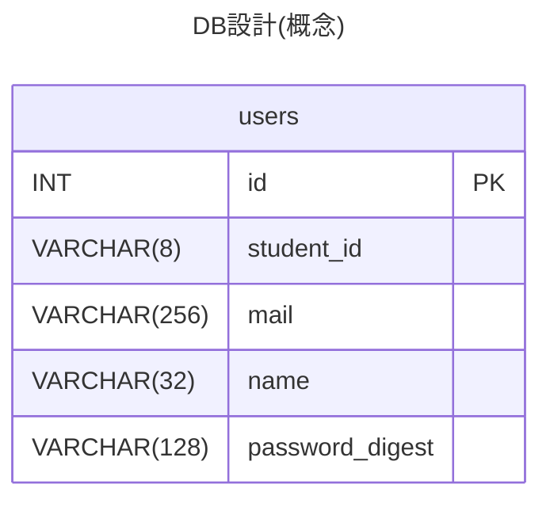
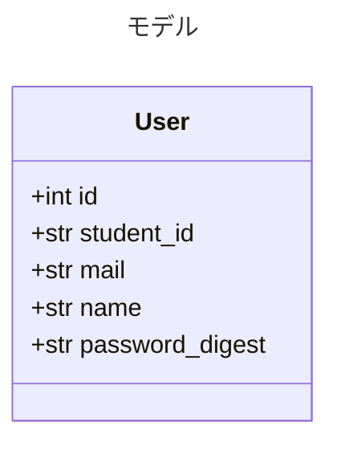

# 概要
本アプリケーションの使用には、以下の項目を用いてアカウントを作成する必要がある。

* 学生証番号（大学のID）
* メールアドレス
* 名前
* パスワード

シミュレーションタスクの生成時には、この機能を用いて作成されたユーザーが紐付けられる。

# 本アプリケーションが持つ機能
## サインアップ機能
ユーザーを作成するための機能。  
フロントから入力された学生証番号、メールアドレス、名前、パスワードを受け取り、バックエンドがデータベースに登録する。  
既存の学生証番号を用いて新しいユーザーを作成することはできない。  
## ログイン機能
以下の情報を用いてユーザー認証を行う。  

- 学生証番号
- パスワード
## ユーザー情報編集機能
ログイン状態のユーザーが自身の情報を変更するための機能。  
以下の情報を編集することができる。  

- 学生証番号
- メールアドレス
- 名前
- パスワード

また、アカウントの削除を行うこともできる。

# モデル
ユーザー情報は通常のActive Recordモデル `User` として定義し、学生証番号 `student_id` をログインIDとして扱う。  
物理テーブル名は `users` とし、DBスキーマの実装上の正は Rails Active Record Migration とする。以下のER図は物理テーブルの主要項目、モデル表・クラス図は属性を示す。制約は共通仕様の共有DB契約に従う。


| 項目         | 型      | 制約                             | 説明                     |
| ---------- | ------ | ------------------------------ | ---------------------- |
| id         | int    | PK, Auto Increment             | ユーザーID                 |
| student_id | string | required, unique, max_length=8 | 学生証番号                  |
| mail       | string | required, max_length=254       | メールアドレス                |
| name       | string | required, max_length=32        | 表示名                    |
| password_digest | string | required, max_length=128 | bcryptでハッシュ化されたパスワード。平文は保存しない |



# パスワードについて
パスワードには以下の制限が含まれる。  
- 6文字以上64文字未満
- 半角文字のみ
パスワード管理には `bcrypt` と `has_secure_password` を利用し、ハッシュ化した値を `password_digest` に保存する。APIで受け取る `password`、`current_password`、`new_password` は入力用であり、DBに平文保存しない。`password_digest` はAPIレスポンスに含めない。

# 認証とSession
WebブラウザはSession Cookie認証を利用する。`student_id` で取得した有効な `User` に対してパスワードを検証し、認証成功後はRails Sessionに `user_id` を保存する。以降のリクエストではCookieを通じてSessionを参照し、`user_id` から `current_user` を特定する。サインアップ成功時も同様にSessionを確立する。ログアウト時およびユーザー無効化時はSessionを破棄する。既存Sessionが残っていても、無効化されたユーザーを `current_user` として認証しない。

```text
student_id + password → User認証 → Sessionにuser_idを保存
以降のリクエスト → Session → current_user → 権限判定・アプリケーション処理
```

Controllerや業務処理はSessionを直接参照せず、認証処理が提供する `current_user` に依存する。将来、CLIからのタスク作成・状態確認・結果取得等に向けたAPI Token認証を追加する場合も、同じ `current_user` と権限判定を利用できる構成とする。API Token認証とCLIはMVP対象外であり、Token発行APIは今回追加しない。JWTは現時点では採用せず、将来方式としても固定しない。

# ユーザー削除の扱い
知見の共有の原理から、ユーザーの削除を行う場合は、ユーザーの無効化を行うこととする。  
これにより、削除されたユーザーはログインできなくなるものの、シミュレーションタスク及び結果は保持される。  

# API
本アプリケーションが実装する全てのAPIは `api/user/` から始まる。  
## サインアップAPI
サインアップを行うためのAPI。  
パスワードのバリデーションチェックを行い、問題がなければデータベースの `users` テーブルにユーザーデータを挿入する。  
登録完了後、ログイン状態にする。  

- URL: `api/user/signup`  
- メソッド: `POST`

フロントからバックエンドにわたすJSONデータ
```json
{
	student_id: str,
	mail: str,
	name: str,
	password: str
}
```

### 成功時
ステータスコード: 204 No Content  
ユーザーをログイン状態にする。  
### 失敗時
処理の失敗時には、その内容に応じて以下のレスポンスが返却される。

| ステータス           | コード                         | 発生要因                    | 備考  |
| :-------------- | --------------------------- | ----------------------- | --- |
| 400 Bad Request | PASSWORD_TOO_SHORT          | パスワードが6文字未満の場合に生じる      |     |
| 400             | PASSWORD_TOO_LONG           | パスワードが64文字以上の場合に生じる     |     |
| 400             | PASSWORD_INVALID_CHARACTARS | パスワードに半角文字以外の文字が含まれる    |     |
| 400             | MAIL_INVALID_FORM           | メールアドレスの形式が不正           |     |
| 409 Conflict    | (なし)                        | 既に存在する学生証番号番号が登録されようとした |     |

## ログインAPI
ログインを行うためのAPI。  
`student_id` で `User` を取得し、`has_secure_password` によって入力パスワードを検証する。認証成功後はRails Sessionに `user_id` を保存し、ユーザーをログイン状態にする。  

- URL: `api/user/login`  
- メソッド: `POST`

フロントからバックエンドにわたすJSONデータ

```JSON
{
	student_id: string,
	password: string
}
```

### 成功時
ステータスコード: 204 No Content
ユーザーをログイン状態にする

### 失敗時
処理の失敗時には、その内容に応じて以下のレスポンスが返却される。

| ステータス            | コード                 | 発生要因                                  | 備考  |
| :--------------- | ------------------- | ------------------------------------- | --- |
| 400 Bad Request  | STUDENT_ID_REQUIRED | 学生証番号の入力が空                            |     |
| 400              | PASSWORD_REQUIRED   | パスワードの入力が空                            |     |
| 401 Unauthorized | LOGIN_FAILED        | 存在しない学生証番号でログインしようとした、またはパスワードが間違っている |     |
| 401              | USER_DISABLED       | 無効化(削除)されたユーザー情報でログインしようとしたとき         |     |


## ログアウトAPI
ログアウトを行うためのAPI。  
ログイン中のユーザーをログアウト状態にし、セッションを削除する。 

- URL: `api/user/logout`  
- メソッド: `POST`

### 成功時
ステータスコード: 204 No Content
ユーザーをログアウト状態にし、セッションを削除する。

### 失敗時
処理の失敗時には、その内容に応じて以下のレスポンスが返却される。  

| ステータス            | コード  | 発生要因            | 備考  |
| :--------------- | ---- | --------------- | --- |
| 401 Unauthorized | (なし) | 未ログイン状態でアクセスされた |     |

## ユーザー情報取得API
ユーザー情報を取得するためのAPI。  
フロントエンドがユーザーのログイン状況を把握するためにも使用される。  

- URL: `api/user/me`
- メソッド: `GET`

### 成功時
ステータスコード: `200 OK`

```json
{
	id: 0,
	student_id: "0CDIM0000",
	mail: "0CDIM0000@tokai.ac.jp",
	name: "東海太郎"
}
```

### 失敗時
| ステータス            | コード           | 発生要因                 | 備考  |
| ---------------- | ------------- | -------------------- | --- |
| 401 Unauthorized | `UAUTHORIZED` | ユーザーのログインセッションが存在しない |     |


## ユーザー情報更新API
ユーザー情報(**パスワードを除く**)の更新を行うためのAPI。  
受け取った値をもとにデータベースの `users` テーブルの値を更新する。  
また、パスワードのバリデーションチェックも実行する。  

- URL: `api/user/me`
- メソッド: `PATCH`

フロントからバックエンドにわたすJSONデータ

```JSON
{
	student_id: string,
	mail: string,
	name: string
}
```

更新が必要な値のみを渡してよい。したがって、以下のようなデータを渡しても良い。  

```json
{
	student_id: string,
	name: string
}
```

**ただし、パスワードは変更できないことに注意**

### 成功時
ステータスコード: 204 No Content
ログイン情報を新しいものに更新する

### 失敗時
処理の失敗時には、その内容に応じて以下のレスポンスが返却される。

| ステータス            | コード  | 発生要因               | 備考  |
| :--------------- | ---- | ------------------ | --- |
| 400 Bad Request  | (なし) | パスワードの変更を要求された     |     |
| 401 Unauthorized | (なし) | ログイン状態でない場合にアクセスした |     |
## パスワード更新API
パスワードを更新するためのAPI。  
ログイン後、放置中に他人が勝手に更新してしまうことを防ぐため、パスワードの変更には現在のパスワードと新しいパスワードの入力を求める。  

- URL: `api/user/password`
- メソッド: `POST`

フロントからバックエンドに渡すデータ
```json
{
	current_password: string,
	new_password: string
}
```

### 失敗時
処理の失敗時には、その内容に応じて以下のレスポンスが返却される。   

| ステータス           | コード                         | 発生要因                    | 備考  |
| :-------------- | --------------------------- | ----------------------- | --- |
| 400 Bad Request | PASSWORD_TOO_SHORT          | 新しいパスワードが6文字未満の場合に生じる   |     |
| 400             | PASSWORD_TOO_LONG           | 新しいパスワードが64文字以上の場合に生じる  |     |
| 400             | PASSWORD_INVALID_CHARACTARS | 新しいパスワードに半角文字以外の文字が含まれる |     |
| 401             | AUTHORIZE_FAILED            | 入力された現在のパスワードが間違っている    |     |
| 401             | UNAUTHORIZED                | 未ログイン状態でアクセスされた         |     |


### ユーザー削除API
ユーザーを削除するためのAPI。  
ログイン中のユーザーを無効化し、ログアウト状態にする。  

- URL: `api/user/me`
- メソッド: `DELETE`

### 成功時
ステータスコード: 204 No Content
ログアウト状態にする。  
### 失敗時
処理の失敗時には、その内容に応じて以下のレスポンスが返却される。  

| ステータス            | コード  | 発生要因            | 備考  |
| :--------------- | ---- | --------------- | --- |
| 401 Unauthorized | (なし) | 未ログイン状態でアクセスされた |     |
